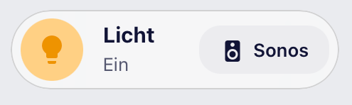

# M3 Cards

> **⚠️ Beta:** This project is new and under active development.
> Configuration options may still change between versions — please file an
> issue if you run into something.

Material 3–inspired, native Lovelace cards for Home Assistant — built with
TypeScript + [Lit](https://lit.dev), **without** any dependency on
`button-card`, `card-mod`, `mod-card`, or `stack-in-card`. A single bundle
(`m3-cards.js`) registers **40 cards**, all sharing one design language.

New here? Start with the category that matches what you want to show — every
card links to its full documentation further down.

### 🔌 Energy & power

| Card | Type | What it does |
| --- | --- | --- |
| [Energy](#m3-energy-card) | `m3-energy-card` | Bar chart per day/hour/month, or a solar day timeline with forecast |
| [Cost](#m3-cost-card) | `m3-cost-card` | Cost breakdown with projection, comparison chip and daily bars |
| [Gauge](#m3-gauge-card) | `m3-gauge-card` | Semicircular gauge for the ratio of two quantities |
| [Energy Flow](#m3-energy-flow-card) | `m3-energy-flow-card` | Node diagram of today's solar/grid/home flows |
| [Power Summary](#m3-power-summary-card) | `m3-power-summary-card` | Grid balance, consumption, generation and self-sufficiency |
| [Power List](#m3-power-list-card) | `m3-power-list-card` | Sorted list of power sensors with threshold filter and share bar |
| [Top Consumers](#m3-top-consumers-card) | `m3-top-consumers-card` | Ranking of the largest consumers, by kWh or cost |
| [Counter](#m3-counter-card) | `m3-counter-card` | A meter reading as a rolling digit display |

### 🌡️ Climate & weather

| Card | Type | What it does |
| --- | --- | --- |
| [Climate](#m3-climate-card) | `m3-climate-card` | Full control for a `climate` entity (AC / thermostat) |
| [Climate Mini](#m3-climate-card-mini) | `m3-climate-card-mini` | Compact climate variant for narrow layouts |
| [Climate Overview](#m3-climate-overview-card) | `m3-climate-overview-card` | Room-by-room temperature/humidity, grouped by area |
| [Weather](#m3-weather-card) | `m3-weather-card` | Temperature curve, precipitation bars, sun markers |

### 💡 Light, media & control

| Card | Type | What it does |
| --- | --- | --- |
| [Light](#m3-light-card) | `m3-light-card` | Light control with a wavy brightness slider, color temp and color wheel |
| [Lights Overview](#m3-lights-overview-card) | `m3-lights-overview-card` | Room-by-room light overview, grouped by area |
| [Media](#m3-media-card) | `m3-media-card` | Media player with artwork colors, wave sliders and a library browser |
| [Button](#m3-button-card) | `m3-button-card` | Generic button/entity card for any domain |
| [Chip Buttons](#m3-chip-buttons-card) | `m3-chip-buttons-card` | A row of tappable pill chips for any entities — like Bubble Card's sub-buttons |
| [Cover](#m3-cover-card) | `m3-cover-card` | Blinds/shutters that adapt to the device's capabilities, plus a group mode |

### 🚪 Presence & safety

| Card | Type | What it does |
| --- | --- | --- |
| [Presence](#m3-presence-card) | `m3-presence-card` | Who's home — avatar grid for `person`/`device_tracker` |
| [Occupancy](#m3-occupancy-card) | `m3-occupancy-card` | Room-by-room presence with an activity timeline |
| [Leak](#m3-leak-card) | `m3-leak-card` | Water-sensor overview with a quiet OK state and a loud alarm + shut-off |

### 🧺 Household & planning

| Card | Type | What it does |
| --- | --- | --- |
| [Progress](#m3-progress-card) | `m3-progress-card` | Appliance progress with a Material 3 wavy indicator |
| [Supply](#m3-supply-card) | `m3-supply-card` | Consumables: amount left, range estimate, one-tap refill |
| [Todo](#m3-todo-card) | `m3-todo-card` | Shopping and task lists with quick-add chips |
| [Waste](#m3-waste-card) | `m3-waste-card` | Bin-collection schedule with a two-week timeline and reminder mode |
| [Time](#m3-time-card) | `m3-time-card` | Time picker for an `input_datetime` helper |
| [Clock](#m3-clock-card) | `m3-clock-card` | A clock in five styles, from rounded tiles to an organic analogue dial |
| [Status](#m3-status-card) | `m3-status-card` | Big numbers, text and yes/no states, with a rule list behind them |
| [Heading](#m3-heading-card) | `m3-heading-card` | Section headings between the cards: simple, with status, a divider, or collapsible |
| [Room](#m3-room-card) | `m3-room-card` | One card per area: every device type it finds, climate readings and presence |
| [Humidifier](#m3-humidifier-card) | `m3-humidifier-card` | Target humidity, mode, fan speed and extras — and it need not be a humidifier entity |
| [Calendar](#m3-calendar-card) | `m3-calendar-card` | Agenda and month grid for any number of calendars |

### 🛠️ System & maintenance

| Card | Type | What it does |
| --- | --- | --- |
| [Battery](#m3-battery-card) | `m3-battery-card` | Battery levels across all `device_class: battery` sensors |
| [Updates](#m3-updates-card) | `m3-updates-card` | Every available update (core, OS, add-ons, HACS, firmware) |
| [NAS](#m3-nas-card--m3-system-card) | `m3-nas-card` | NAS volumes, CPU, RAM, network via Glances + Syncthing |
| [System](#m3-nas-card--m3-system-card) | `m3-system-card` | The same, fed by the System Monitor integration |
| [Search](#m3-search-card) | `m3-search-card` | A Material 3 search bar on the dashboard, opening HA's entity/command search and Assist |

### 🐠 Special

| Card | Type | What it does |
| --- | --- | --- |
| [Aquarium](#m3-aquarium-card) | `m3-aquarium-card` | Per-aquarium devices, lighting arc, camera and maintenance |

### 🧱 Layout

| Card | Type | What it does |
| --- | --- | --- |
| [Group](#m3-group-card) | `m3-group-card` | Wraps other cards in one shared frame, so they read as a single card |
| [Nav](#m3-nav-card) | `m3-nav-card` | A bottom or top navigation bar for the dashboard, in five variants |

*All cards at a glance:*


<sub>Taken on a real Home Assistant instance. The washing machine, floor lamp,
speaker, air conditioner and the updates show simulated states so the active
renderings (wave indicator, version jump, running installation) are visible in
the image — everything else is live data.</sub>

## Features

- Frosted glass card look (can be turned off for solid themes), shared
  design language across all cards
- Mode pills with shape-morph animation (round → rounded rectangle)
- Temperature stepper with step size/limits taken from the entity
- Optional external temperature/humidity sensors, window and battery chips
- Preset support (tap to cycle, as its own row or as a pill in the mode
  row)
- Configurable card height + full height matching in
  `horizontal-stack`/grid layouts for tiles of exactly equal height
- Full graphical editor (no YAML required) — modeled after the native tile
  card editor, with a unified appearance panel (corner-radius presets,
  per-corner overrides) across every card
- `unavailable` handling without crashing: values shown as "–", controls
  dimmed
- Localized in German/English (follows `hass.locale.language`)
- Accessible: every interactive element is keyboard-reachable
  (Tab/Enter/Space) with a visible focus ring and `aria-label`
- Respects `prefers-reduced-motion` throughout, additionally overridable
  per card via `animation: auto | on | off`
- Old configs (e.g. `animations: true/false`) are migrated to the current
  schema automatically on load — no manual dashboard edits needed
- [Jinja2 templates](#templates) in every card's own string fields, live over
  the websocket — no template-sensor helper per card

## Installation

### HACS (recommended)

[](https://my.home-assistant.io/redirect/hacs_repository/?owner=UHaFnir&repository=m3-cards&category=plugin)

The button opens the repository straight in your own Home Assistant — press
*Download* and you are done. To add it by hand instead:

1. HACS → menu (⋮) in the top right → *Custom repositories*
2. Enter the repository URL, pick type **Dashboard**, then *Add*
   (**not** *Integration* — this is a Lovelace card, not an integration)
3. Search for "M3 Cards", open it and press *Download*
4. Reload Home Assistant

### Manual

1. Download the latest `m3-cards.js` from the
   [Releases](../../releases)
2. Copy it to `config/www/m3-cards.js`
3. Add the resource in Home Assistant:
   *Settings → Dashboards → Resources → Add resource*
   - URL: `/local/m3-cards.js`
   - Type: JavaScript module

## Templates

Every card accepts Jinja2 in **its own string fields** — name, icon, colour,
unit, whatever that card reads out of its config. A field is treated as a
template as soon as it contains `{{` or `{%`; everything else is left alone.

```yaml
type: custom:m3-button-card
entity: light.kitchen
name: "{{ states('sensor.kitchen_temperature') | round(1) }} °C"
icon: >-
  {{ 'mdi:lightbulb-on' if is_state('light.kitchen', 'on') else 'mdi:lightbulb' }}
```

Before, a field could only be a fixed string or one entity's raw state. A
composed label meant a template-sensor helper in `configuration.yaml` for every
card that wanted one — and an icon that depends on an entity had no way to be
expressed at all:

```yaml
# configuration.yaml — one of these per card, no longer needed
template:
  - sensor:
      - name: Kitchen label
        state: "{{ states('sensor.kitchen_temperature') | round(1) }} °C"
```

Values are **pushed**, not polled: the card subscribes to the template over
Home Assistant's websocket, and Home Assistant re-renders it whenever anything
the template reads changes. One subscription per distinct template — two fields
sharing the same string share one — and they are all closed when the card
leaves the page.

A card that uses no templates behaves exactly as it always has and pays nothing
for the feature: nothing is walked, subscribed or copied.

### Nested cards are left alone

Card configs can contain other cards: `cards:` on the group and room cards, the
content of a popup action, a mushroom card dropped into a slot. **Templates
inside those are not rendered here** — they are passed through untouched to the
card they belong to.

```yaml
type: custom:m3-room-card
area: kitchen
name: "{{ states('sensor.kitchen_temperature') | round(1) }} °C"   # rendered here
cards:
  - type: custom:mushroom-template-card
    primary: "{{ states('sensor.kitchen_humidity') }} %"           # left for mushroom
```

The reason is that the inner card renders its own templates, and it renders
them *live*. Resolving `primary` above would hand mushroom the one string it
happened to say at the moment the room card was configured — the field would
freeze at that value and never follow the sensor again. The rule is mechanical:
the walk stops at any nested object that carries its own `type`, which is what
a card config looks like whatever card it is for.

The nav card is the exception in the other direction: its entries had templates
before this existed, with `hidden` / `disabled` read as booleans, and they work
as documented under [M3 Nav Card](#m3-nav-card).

## M3 Climate Card

Both climate cards draw an **action-glow frame** around their outer edge in the
heat/cool accent colour, so a wall of thermostats tells you at a glance which
rooms are calling for heat. It has two strengths: full while the entity's
`hvac_action` reports `heating`/`cooling`, and dimmed while `heat`/`cool` is the
selected mode but the equipment is idle. That second level exists because many
integrations derive `hvac_action` from the physical valve — Homematic's
eTRV/HEATING devices, for instance, report `idle` for entire seasons, and a
frame that only ever lit on `heating` would be invisible there. Entities that
expose no `hvac_action` at all get the full frame from their mode alone. Turn it
off per card with `show_action_glow: false`.

Add the card via the dashboard editor (search for "M3 Climate Card") or via
YAML:

<details>
<summary>Configuration, examples & options</summary>


```yaml
type: custom:m3-climate-card
entity: climate.living_room
name: Living Room
show_presets: true
preset_style: chip # chip | pill
show_control_labels: true
show_sensors: true
temperature_chip_placement: info_row # info_row | header
temperature_sensor: sensor.living_room_temperature
humidity_sensor: sensor.living_room_humidity
window_sensor: binary_sensor.living_room_window
battery_sensor: sensor.thermostat_battery
battery_threshold: 20
glass_background: true
hidden_modes: []
height: 380
mode_colors:
  heat: "#e57368"
  cool: "#6ba7dc"
```

### Folding a room away

`collapsible: true` puts a chevron in the header and folds the card down to
that header when it is tapped. The subtitle stays — "occupied · 3 devices on"
is exactly what a folded room still needs to say, and a fold that hid it would
turn the card into a label.

The state persists per browser, or across devices in an `input_boolean` via
`collapse_state_entity` — which also lets an automation fold the guest room
away while nobody is in it.

```yaml
type: custom:m3-room-card
area: guest_room
collapsible: true
default_collapsed: true
```

### Configuration options

| Option | Type | Default | Description |
|---|---|---|---|
| `entity` | string | **Required** | `climate.*` entity |
| `name` | string | entity `friendly_name` | Displayed name |
| `icon` | string | `mdi:radiator` (heating only) / `mdi:air-conditioner` | Header icon |
| `show_presets` | boolean | `true` | Show preset selector (if the entity supports `preset_modes`) |
| `preset_style` | `chip` \| `pill` | `chip` | Preset button with its name (`chip`) or icon-only (`pill`). It shares one row with the mode button either way |
| `show_control_labels` | boolean | `true` | Show the text labels on the mode and preset buttons. `false` leaves both as icon-only circles |
| `show_sensors` | boolean | `true` | Show the large current-temperature figure and the humidity line above the setpoint row |
| `temperature_chip_placement` | `info_row` \| `header` | `info_row` | Current temperature as the card's large centre figure (`info_row`) or as a small chip top-right in the header (`header`), which drops the large figure |
| `temperature_sensor` | string | – | External temperature sensor, overrides `current_temperature` |
| `humidity_sensor` | string | – | External humidity sensor, overrides `current_humidity` |
| `window_sensor` | string | – | `binary_sensor`, shows an "Open" chip when `state: "on"` |
| `battery_sensor` | string | – | Sensor for battery level |
| `battery_threshold` | number | `20` | Threshold (%) below which the battery chip appears |
| `hidden_modes` | string[] | `[]` | HVAC modes that are hidden as a pill despite entity support |
| `glass_background` | boolean | `true` | Frosted glass background (off for solid themes) |
| `animations` | boolean | `true` | Shape-morph/press animations; `false` disables all transitions |
| `show_action_glow` | boolean | `true` | Squared-off glow frame around the card: full strength while `hvac_action` reports heating (warm) or cooling (blue), dimmed while `heat`/`cool` is selected but the equipment is idle. Entities that report no `hvac_action` get the full frame from their mode alone |
| `unavailable_style` | `dimmed` \| `normal` \| `hidden` | `dimmed` | Display when the entity is `unavailable`/`unknown`: `dimmed` (greyed out, not tappable, as before), `normal` (normal display, mode pills/stepper stay tappable), or `hidden` (card is fully hidden) |
| `height` | number (px) | – (automatic) | Fixed minimum card height. See [Equal-height tiles](#equal-height-tiles) |
| `radius` | number (px) | `32` | Card corner radius (editor offers Square/Slightly rounded/Round/Custom) |
| `corners` | object | – | Optional per-corner override: `top_left`, `top_right`, `bottom_right`, `bottom_left` (px) — for asymmetric Material 3 Expressive shapes, only overrides `radius` for the given corners |
| `mode_colors` | object | see below | Color override per HVAC mode. The editor shows a text field + color swatch; accepts hex/CSS **or** HA color names, same as the button card's `color` |
| `icon_active_color` | string | `var(--primary-color)` | Header icon color when active (not "off") |
| `icon_inactive_color` | string | `var(--primary-color)` | Header icon color in the "off" state |
| `plus_active_color` | string | current mode's color | Plus button color when active |
| `plus_inactive_color` | string | `mode_colors.off` | Plus button color in the "off" state |
| `minus_active_color` | string | `var(--primary-text-color)` | Minus button color when active |
| `minus_inactive_color` | string | `var(--primary-text-color)` | Minus button color in the "off" state |

Without any explicit setting, the icon stays in the theme accent color
(`--primary-color`) as before; minus stays neutral. `icon_active_color` /
`icon_inactive_color` / `plus_active_color` / `plus_inactive_color` /
`minus_active_color` / `minus_inactive_color` allow a fully independent
color per element and state ("off" vs. active).

#### Default mode colors

| Mode | Color |
|---|---|
| `off` | `#9e9e9e` |
| `heat` | `#e57368` |
| `cool` | `#6ba7dc` |
| `dry` | `#5dcaa5` |
| `auto` | `#5dcaa5` |
| `fan_only` | `#b8c4c9` |
| `heat_cool` | `#e5a768` |

### Equal-height tiles

HA's native masonry dashboard does **not** automatically equalize the
height of cards next to each other — every column grows independently
based on its own content. Two options:

1. **Use `horizontal-stack`** (recommended, no manual value needed): cards
   in a `horizontal-stack` are automatically stretched by Home Assistant
   via flexbox to the height of the tallest card — the M3 cards fill that
   height completely (including the stepper, which docks to the bottom):
   ```yaml
   type: horizontal-stack
   cards:
     - type: custom:m3-climate-card
       entity: climate.ac
     - type: custom:m3-climate-card
       entity: climate.living_room
   ```
2. **Set `height` manually**: if no `horizontal-stack` is used, a fixed
   pixel value (`height: 380`) can be set per card.

</details>

## M3 Climate Card Mini

A compact companion card to the full climate card: icon tile + on/off
button on top, name + "current temperature · mode" below that, and a
minus/setpoint/plus stepper at the bottom whose middle segment carries the
target temperature in the active mode's colour. No preset, sensor, or
mode-row support — in exchange, two tiles comfortably fit side by side on a
phone screen. It carries the same two-strength action-glow frame as the full
card (see above), which reads especially well at this size: a row of minis
shows which rooms are heating without any of them spelling it out in text.

<details>
<summary>Configuration, examples & options</summary>


```yaml
type: custom:m3-climate-card-mini
entity: climate.bedroom
name: Bedroom
glass_background: true
mode_colors:
  heat: "#e57368"
  cool: "#6ba7dc"
```

### Configuration options

| Option | Type | Default | Description |
|---|---|---|---|
| `entity` | string | **Required** | `climate.*` entity |
| `name` | string | entity `friendly_name` | Displayed name |
| `icon` | string | `mdi:radiator` (heating only) / `mdi:air-conditioner` | Icon in the icon tile |
| `glass_background` | boolean | `true` | Frosted glass background (off for solid themes) |
| `show_action_glow` | boolean | `true` | Squared-off glow frame around the card: full strength while `hvac_action` reports heating (warm) or cooling (blue), dimmed while `heat`/`cool` is selected but the equipment is idle. Entities that report no `hvac_action` get the full frame from their mode alone |
| `animations` | boolean | `true` | Transitions for icon tile/on-off button/stepper; `false` disables them |
| `unavailable_style` | `dimmed` \| `normal` \| `hidden` | `dimmed` | Display when the entity is `unavailable`/`unknown` |
| `radius` | number (px) | `28` | Card corner radius (editor offers Square/Slightly rounded/Round/Custom) |
| `corners` | object | – | Optional per-corner override: `top_left`, `top_right`, `bottom_right`, `bottom_left` (px) |
| `mode_colors` | object | see [default mode colors](#default-mode-colors) | Color override per HVAC mode |
| `icon_active_color` | string | current mode's color | Icon color when heating/cooling is active (not "off") |
| `icon_inactive_color` | string | `mode_colors.off` | Icon color in the "off" state |
| `power_active_color` | string | current mode's color | On/off button color when active |
| `power_inactive_color` | string | `mode_colors.off` | On/off button color in the "off" state |
| `plus_active_color` | string | current mode's color | Plus button color when active |
| `plus_inactive_color` | string | `mode_colors.off` | Plus button color in the "off" state |
| `minus_active_color` | string | `var(--primary-text-color)` | Minus button color when active |
| `minus_inactive_color` | string | `var(--primary-text-color)` | Minus button color in the "off" state |

Icon, on/off button, and plus color follow `mode_colors` by default
(including "off"), so they can already be adjusted just via
`mode_colors.off`; minus stays neutral by default. `icon_active_color` /
`icon_inactive_color` / `power_active_color` / `power_inactive_color` /
`plus_active_color` / `plus_inactive_color` / `minus_active_color` /
`minus_inactive_color` additionally allow a fully independent color per
element and state.

The on/off button calls `homeassistant.toggle` on the entity. Tapping the
icon tile, the name/status, or the target-temperature display opens the
more-info dialog.

</details>

## M3 Button Card

A generic card for entities outside of `climate` (buttons, switches,
lights, scenes, door sensors, ...) in the same design. Can also embed its
own row of [chip buttons](#m3-chip-buttons-card) — see `chip_buttons` below.

<details>
<summary>Configuration, examples & options</summary>


```yaml
type: custom:m3-button-card
entity: button.front_door_open
name: Open front door
icon: mdi:door
color: dark-grey
state_colors:
  open: red
  locked: green
show_state: false
show_icon_background: true
show_slider: false
vertical: false
radius: 28
glass_background: true
tap_action:
  action: toggle
hold_action:
  action: more-info
```

### Configuration options

| Option | Type | Default | Description |
|---|---|---|---|
| `entity` | string | – (optional) | Any entity — including `automation.*`, `script.*`, `scene.*`. Can be left empty for a pure action button without an entity state (see below) |
| `name` | string | entity `friendly_name` | Displayed name |
| `icon` | string | entity icon, otherwise HA's default icon for the domain/`device_class` | Icon. Without an explicit value, the same default icon HA computes for the native tile card is used (e.g. a thermometer for `device_class: temperature`), not just an icon explicitly set on the entity |
| `icon_off` | string | – (falls back to `icon`) | Separate icon shown while the entity is off — e.g. a struck-through variant, so the off state reads from the shape, not just the color |
| `icon_fill` | `tint` \| `solid` | `tint` | How the icon well is filled in the **on** state: `tint` is a soft wash of the accent color with a colored glyph, `solid` fills the well with the accent color and darkens the glyph — bolder, reads first from a distance |
| `shape_by_state` | boolean | `false` | The button's shape follows the entity state: a capsule while off, the configured `radius` while on, with the icon well morphing between a circle and a rounded square. Animated |
| `color` | string | `primary` (uses HA's theme accent color) | HA color name (`red`, `dark-grey`, `deep-orange`, ...) **or** any CSS color (`#hex`, `rgb(...)`) for the icon/background in the **on/active** state |
| `inactive_color` | string | – (default theme grey) | Color for the icon/background in the **off/inactive** state, same format as `color`. Also used when `static_color: true` is set |
| `invert_colors` | boolean | `false` | Swaps `color` and `inactive_color` (or their defaults) without needing custom colors — e.g. to quickly flip "light in the off state, accent color in the on state" into "accent color in the off state, light in the on state" |
| `state_colors` | object | – | Color override per entity state (e.g. `open`, `locked`), overrides `color` only for that state. The editor offers the most common states as fields; any state name is possible via YAML |
| `static_color` | boolean | `false` | Always show the icon/background in `inactive_color` (or the default grey), regardless of entity state — e.g. for devices that are permanently on and shouldn't be visually highlighted as "active". Freely stylable via `inactive_color` |
| `unavailable_style` | `dimmed` \| `normal` \| `hidden` | `dimmed` | Display when the entity is `unavailable`: `dimmed` (greyed out, not tappable, as before), `normal` (normal display, stays tappable — e.g. so `hold_action: more-info` remains usable for diagnostics), or `hidden` (card is fully hidden) |
| `show_state` | boolean | `true` | Show the status line under the name |
| `state_content` | `state` \| `last_changed` \| `last_updated` | `state` | Content of the status line: the entity state itself, or a relative time since the last state change / last update (e.g. "3 hours ago") |
| `show_icon_background` | boolean | `true` | Colored circle behind the icon |
| `icon_size` | number (px) | – (automatic, scales with card height) | Fixed icon size independent of card height, so buttons of different height (e.g. `rows: 1` vs. `rows: 2`) have visually equal-sized icons |
| `align_icons` | boolean | `false` | Align icons at the same distance from the left edge regardless of card height — useful together with `icon_size` so stacked cards of different heights line up visually. Vertical centering is unaffected |
| `show_slider` | boolean | `false` | Show a slider under the icon/text — only effective for `light` (brightness), `cover` (position), `fan` (speed), `input_number`/`number` (value) |
| `vertical` | boolean | `false` | Icon above the text instead of next to it |
| `radius` | number (px) | `28` | Card corner radius. In the editor as a preset ("Square" 8px / "Slightly rounded" 16px / "Round" 28px) or freely chosen |
| `corners` | object | – | Optional per-corner override: `top_left`, `top_right`, `bottom_right`, `bottom_left` (px) — for asymmetric Material 3 Expressive shapes, e.g. a button with only one rounded side |
| `glass_background` | boolean | `true` | Frosted glass background |
| `animations` | boolean | `true` | Press animation (slight sink-in on tap); `false` disables all transitions |
| `tap_action` | Action | domain-dependent | Chosen sensibly by default: `automation.trigger`/`script.turn_on`/`scene.turn_on`/`button.press` for the respective domain, `toggle` for light/switch/etc., otherwise `more-info` |
| `hold_action` | Action | `more-info` | Action on long-press (on the whole tile) — same as the native tile card |
| `double_tap_action` | Action | `none` | Action on double-tap (on the whole tile) |
| `icon_tap_action` | Action | `more-info` | Its own tap action for just the icon/icon circle, independent of `tap_action` — same as the native tile card |
| `icon_hold_action` | Action | `none` | Action on long-press on the icon |
| `icon_double_tap_action` | Action | `none` | Action on double-tap on the icon |
| `chip_buttons` | list | `[]` | An embedded row of [chip buttons](#m3-chip-buttons-card) — same fields as the Chip Buttons Card's `buttons[]` (`entity`, `name`, `icon`, `color`, `inactive_color`, `show_name`, `show_state`, `static_color`, `interactive`, `tap_action`, `hold_action`, `double_tap_action`) |
| `chip_buttons_justify` | `start` \| `center` \| `end` | `end` | Alignment of the chip row — only takes effect once the card is resized taller than a normal row (see below); at normal height the chips are always right-aligned |

Active states (`on`, `open`, `home`, `playing`, ...) color the icon and
icon background in the configured `color` (or the matching
`state_colors` override); entities without a persistent state (`button`,
`script`, `scene`) are always colored.

Triggering automations/scripts/scenes works like any other entity —
`entity: automation.good_morning` is enough, a tap triggers the automation
directly thanks to the domain-dependent default `tap_action` (no manual
`call-service` needed unless you want something different).

#### Pure action button (without an entity)

`entity` can be omitted entirely if the card should only trigger an action
(e.g. start a script/automation) without showing an entity state. Without
`entity`, no status text is shown and the icon is always colored (like
`button`/`script`):

```yaml
type: custom:m3-button-card
name: Feed the cat
icon: mdi:cat
color: dark-grey
tap_action:
  action: perform-action
  perform_action: script.feed_10g
  target: {}
```

#### Embedded chip buttons

`chip_buttons` adds a row of tappable chips to the button itself — e.g. a
quick shortcut to the room's media player right on its light button. At
normal card height they sit right-aligned next to the icon/text; resize the
card taller (e.g. `rows: 2` in the sections view) and they move to a
bottom bar whose alignment is set via `chip_buttons_justify`.



```yaml
type: custom:m3-button-card
entity: light.living_room
name: Licht
chip_buttons:
  - icon: mdi:speaker
    name: Sonos
    interactive: false
chip_buttons_justify: end
```

</details>

## M3 Progress Card

A progress card for household appliances with status/percentage/remaining-
time sensors (washing machine, dryer, dishwasher, 3D printer, ...). The
progress bar is a Material 3 Expressive "wavy" indicator: a wave-shaped,
animated active part, a gap, a flat track, and an end-point dot.

<details>
<summary>Configuration, examples & options</summary>


```yaml
type: custom:m3-progress-card
entity: sensor.washing_machine_status
percentage_entity: sensor.washing_machine_progress_percent
remaining_entity: sensor.washing_machine_remaining_minutes
name: Washing Machine
icon: mdi:washing-machine
glass_background: true
```

### Status logic

The status sensor is matched (case-insensitively) to one of four
categories, each with its own status text:

| Category | Default status values | Default status text | Bar |
|---|---|---|---|
| Running | `wash`, `spin`, `rinse` | "{remaining} min. remaining" | animated wave |
| Preparing | `detecting_load` | "Detecting load…" | animated wave (even without a percentage value: an "indeterminate" segment sweeps across the track) |
| Done | `end`, `finished` | "Done! Laundry is clean." | bar at 100%, wave settles into a straight line |
| Ready (all other values) | – | "Ready" | hidden, card collapses to header height |

The status-value lists are freely configurable via `running_states` /
`preparing_states` / `done_states`; `{remaining}` in the status text is
replaced with the value of `remaining_entity` (if the sensor is missing,
only the minutes part is dropped, no crash). `percentage_entity`/
`remaining_entity` are optional — without `percentage_entity`, the bar runs
as an indeterminate animation in the "preparing" state.

### Configuration options

| Option | Type | Default | Description |
|---|---|---|---|
| `entity` | string | **Required** | Status sensor |
| `percentage_entity` | string | – | Sensor with progress in percent (0–100) |
| `remaining_entity` | string | – | Sensor with remaining time in minutes |
| `name` | string | entity `friendly_name` | Displayed name |
| `icon` | string | `mdi:washing-machine` | Icon in the icon tile |
| `status_text_running` / `_preparing` / `_done` / `_ready` | string | see table above | Status text per category; `{remaining}` as a placeholder in `status_text_running` |
| `running_states` / `preparing_states` / `done_states` | string[] | see table above | Status values per category (case-insensitive) |
| `animation` | `auto` \| `on` \| `off` | `auto` | `auto`/`on` respect the system's `prefers-reduced-motion` (then a static line); `off` always disables the animation |
| `wave_style` | `wavy` \| `flat` | `wavy` | Only with `animation: off` — frozen wave or straight line; both still show fill level/gap/dot |
| `hide_when_ready` | boolean | `false` | Hide the whole card in the "ready" state (instead of just the bar) |
| `glass_background` | boolean | `true` | Frosted glass background (off for solid themes) |
| `radius` | number (px) | `28` | Card corner radius |
| `corners` | object | – | Optional per-corner override: `top_left`, `top_right`, `bottom_right`, `bottom_left` (px) |

#### Colors

All colors are optional; unset fields follow the theme. Internally stored
as CSS custom properties (`--m3p-accent`, `--m3p-track`, `--m3p-dot`, …) on
the card — so they can also be overridden via `card-mod` or a theme if
needed.

| Option | Default | Description |
|---|---|---|
| `accent_color` | `#85b7eb` | Wave, percentage, icon |
| `track_color` | 12% `--primary-text-color` | Flat track |
| `dot_color` | 70% `--primary-text-color` | End-point dot |
| `icon_color` | accent color | Icon color |
| `icon_background` | 18% icon color | Icon tile background |
| `text_color` | `--primary-text-color` | Name |
| `secondary_text_color` | `--primary-text-color` | Status line |
| `card_background` | glass/solid background | Card background |
| `state_colors.running` / `.preparing` / `.done` | – | Overrides `accent_color` only for that category (e.g. green when "done") |

```yaml
type: custom:m3-progress-card
entity: sensor.washing_machine_status
percentage_entity: sensor.washing_machine_progress_percent
remaining_entity: sensor.washing_machine_remaining_minutes
state_colors:
  done: green
```

</details>

## M3 Energy Card

A bar chart for energy values (solar generation, consumption, ...). `mode`
provides two fundamentally different views:

<details>
<summary>Configuration, examples & options</summary>


- **`mode: consumption`** (default) — bars per day or per hour for a
  single entity, see `period` below.
- **`mode: solar`** — the day's solar generation timeline including a
  forecast, see its own section further below.

`mode: consumption` isn't limited to electricity — unit and icon are taken
from the entity (icon automatically based on `device_class`: `gas` →
flame, `water` → water drop, otherwise lightning bolt, unless explicitly
set via `icon`), so the mode works just as well for gas or water meters.

### `mode: consumption` — time ranges via `period`

- **`period: day`** (default) — the last N days as bars plus today's value
  prominently in the header, live from the current entity state.
- **`period: hour`** — the last N hours of today plus the running hour,
  with a value row above the bars.
- **`period: month`** — the last N months (rolling, including the current
  month) with a projection, average line, and comparison chips, see its
  own section further below.

```yaml
type: custom:m3-energy-card
entity: sensor.solar_energy_total_daily
name: Solar Generation
icon: mdi:solar-power
accent_color: "#66bb6a"
period: day
days: 7
```

```yaml
type: custom:m3-energy-card
entity: sensor.grid_consumption_hourly
name: Consumption per Hour
icon: mdi:lightning-bolt
period: hour
hours: 6
```

### Data retrieval

Past days/hours/months are loaded primarily via HA's long-term statistics
(`recorder/statistics_during_period`, configurable via `statistic_type`):

- `state` (default for `period: day`/`hour`) — the last raw value of the
  period, suitable for meter sensors that periodically reset (e.g.
  `*_daily`/`*_hourly` sensors like Shelly's). Equivalent to what a
  `mini-graph-card` would show with `aggregate_func: max`.
- `change` — the difference within the period, suitable for a never-reset
  cumulative counter. **Default for `period: month`**: even a daily-
  resetting counter needs `change` here, because its `state` at month
  granularity only returns the value of the last day of the month (a few
  kWh), not the monthly sum — `change` correctly accumulates across all
  daily resets instead.

If the entity has no long-term statistics, a History API fallback kicks in
automatically for `period: day`/`hour` (values aggregated by maximum per
day/hour). For `period: month` there is no fallback (a month-scale History
query would be impractically large) — instead the card shows a clear
message. Whether an entity has long-term statistics can be checked under
**Developer tools → Statistics** — the editor also shows a hint for
`period: day`/`hour` if it doesn't. The current day/hour/month is always
computed live (or, for `change`, via a short-term statistics sum since the
period start), not from long-term statistics, since that period isn't
complete yet. Data refreshes every 15 minutes in day mode, every 5 minutes
in hour mode, and hourly in month mode.

Windows and doors get a chip of their own: any `binary_sensor` in the area with
device class `window`, `door`, `garage_door` or `opening`. It shows whenever
such a sensor exists, closed included — "all shut" is the half of the answer
you go looking for on the way out of the house — and turns amber with a count
when something is open. `window_entities` overrides the discovery, which is
worth knowing about: window sensors are often left unassigned to an area, and
nothing can discover what is not filed anywhere.

### Interaction

Tapping a bar briefly shows a value bubble with the amount (with a slight
morph: corner radius 9→6px, brightening); tapping the header opens the
entity's more-info view. On first render, bars grow in with a stagger
(30ms per bar) to their target height — respects the `animation` option
and `prefers-reduced-motion`. In hour mode, with more than 12 bars (e.g.
`hours: 24`) the value row is automatically hidden and only every other
hour label is shown, so it doesn't get too cramped.

### `period: month` — projection, comparison, average

```yaml
type: custom:m3-energy-card
entity: sensor.grid_consumption_daily
name: Consumption per Month
icon: mdi:calendar-month
period: month
months: 12
```

- **Projection**: the current month is shown as a filled actual bar plus a
  dashed outline — the outline shows where the month would land at the
  current daily average (`actual value ÷ days elapsed × days in month`).
  Can be disabled via `show_projection: false`.
- **Average line**: a dashed horizontal line at the level of the average
  of completed months. Can be disabled via `show_average: false`.
- **Comparison chips** below the header (can be disabled via
  `show_comparison: false`):
  - Chip 1 compares the projection (or the actual value, if
    `show_projection: false`) to the previous month in percent — green
    for less consumed, red for more. For generation values (e.g.
    `mode: solar` or your own meters), flip this logic with
    `higher_is_better: true` so "more" is green.
  - Chip 2 shows the average of the completed months ("avg X kWh").
- With `months > 12`, only every other month is labeled, so the axis
  doesn't get too cramped (same threshold as in hour mode).

### `mode: solar` — day timeline with forecast

Shows today's solar generation timeline as bars plus, if available, a
forecast overlay (dashed outline):

```yaml
type: custom:m3-energy-card
mode: solar
source: energy
name: Solar Generation
glass_background: true
```

- **`source: energy`** (default) — automatically sums all solar sources
  from the HA Energy dashboard (**Settings → Dashboards → Energy**),
  without needing to specify an entity manually.
- **`source: entity`** — uses a single, freely chosen `entity` instead.
- **Forecast**: loaded automatically via `energy/solar_forecast` if a
  forecast integration (Forecast.Solar, Solcast, …) is configured in the
  Energy dashboard. Alternatively, `forecast_entity` provides your own
  forecast entity (expects a `wh_hours` attribute, timestamp → Wh — the
  format used by Forecast.Solar/Solcast sensors). If no forecast is
  available, the card works normally, just without the outline bars and
  without "of X kWh expected" in the header.
- **Bars**: past/running hours filled (running hour full accent color,
  past hours as a 30% tint); future hours only as a dashed outline (pure
  forecast); if the running hour is still below the forecast, the
  difference is stacked as a dashed outline on top of the filled bar.
- **Time range**: automatically trimmed to the first through last hour
  with generation or forecast > 0 (not 0–24h, otherwise there would be
  empty bars in the morning/at night); `full_day: true` forces the full
  0–24h range.
- **Statistic type**: solar sensors from the Energy dashboard are almost
  always lifetime counters (never reset), so the default here is `change`
  instead of `state` (see Data retrieval above).
- **Comparison/average chips** (like `period: month`, see above): one chip
  shows today's (generation + forecast) value in % over/under yesterday, a
  second shows the average of the last 7 days. Controlled via
  `show_comparison`/`show_average` (both on by default).

### Configuration options

| Option | Type | Default | Description |
|---|---|---|---|
| `mode` | `consumption` \| `solar` | `consumption` | Bars per day/hour or a solar day timeline with forecast |
| `entity` | string | **Required** except for `mode: solar` + `source: energy` | Energy sensor |
| `statistic_type` | `state` \| `change` | `state` (`change` for `mode: solar` or `period: month`) | Statistic type for the bar values |
| `period` | `day` \| `hour` \| `month` | `day` | Bars per day, hour, or month — only for `mode: consumption` |
| `days` | number | `7` | Number of past days (3–14), only for `period: day` |
| `hours` | number | `6` | Number of past hours (3–24), only for `period: hour` |
| `months` | number | `12` | Number of months including the current one (3–24), only for `period: month` |
| `source` | `entity` \| `energy` | `entity` | Only for `mode: solar`: single entity or all Energy-dashboard solar sources |
| `forecast_entity` | string | — | Only for `mode: solar`: your own forecast entity (optional, fallback when no Energy-dashboard forecast is configured) |
| `full_day` | boolean | `false` | Only for `mode: solar`: always show 0–24h instead of trimming |
| `show_values` | boolean | `false` | Show the value row above the bars in day mode too (it's on by default in hour mode; not available for `mode: solar`/`period: month`) |
| `show_legend` | boolean | `true` | Only for `mode: solar`: "Generated"/"Forecast" legend below the bars (only visible if a forecast is present) |
| `show_projection` | boolean | `true` | Only for `period: month`: show the current month's projection as a dashed outline |
| `show_average` | boolean | `true` | Only for `period: month`: show the dashed average line |
| `show_comparison` | boolean | `true` | Only for `period: month`: show comparison chips (previous month, average) below the header |
| `higher_is_better` | boolean | `false` | Only for `period: month`: flip the comparison chip's color logic (for generation instead of consumption values) |
| `comparison_better_color` | string | `#81c784` | Only for `period: month`: comparison chip color for "better" |
| `comparison_worse_color` | string | `#e57368` | Only for `period: month`: comparison chip color for "worse" |
| `name` | string | entity `friendly_name` | Displayed name |
| `icon` | string | `mdi:solar-power` (`mdi:solar-power-variant` for `mode: solar`) | Icon in the icon tile |
| `subtitle` | string | "Last {days} days" / "Today · last {hours} hours" / "Per month · {months} months" / "Today · day timeline" | Subtitle override |
| `accent_color` | string | `#81c784` | Accent color (current bar, current value, icon, outline forecast/projection) |
| `bar_tint_color` | string | 28% accent color (30% for `mode: solar`) | Color of past bars |
| `text_color` / `secondary_text_color` | string | theme default | Name / axis labels |
| `card_background` | string | glass/solid background | Card background |
| `animation` | `auto` \| `on` \| `off` | `auto` | Affects the tap-morph + grow-in effect; `auto`/`on` respect `prefers-reduced-motion` |
| `glass_background` | boolean | `true` | Frosted glass background |
| `radius` / `corners` | number / object | `28` | Corner radius, optional per corner |

</details>

## M3 Gauge Card

Replaces an `energy-grid-neutrality-gauge` tile: shows the ratio of two
quantities (e.g. grid import vs. export) as a semicircular arc with the net
value in the middle. Two segments with a small gap at the transition point
— the gap itself is the "pointer", not a separate needle.

<details>
<summary>Configuration, examples & options</summary>


```yaml
type: custom:m3-gauge-card
name: Grid Balance
```

### Data sources

- **`source: energy`** (default, no further configuration needed if the HA
  Energy dashboard is set up): reads the configured grid import/export
  statistic IDs from `energy/get_prefs` (multiple meters/tariffs are
  summed automatically) and loads their daily values.
- **`source: entities`**: two freely chosen sensors (`value_a_entity` =
  import, `value_b_entity` = export), the time reference then lies with
  the sensors themselves. Not limited to electricity — the unit is taken
  from the configured entities, e.g. for comparing two gas or water
  meters.

If both values are 0, the arc shows only the track color ("No data today"
or "No Energy dashboard configured"); if only one value is 0, the whole
arc fills continuously in one color without a gap.

### Animation

The segments grow from 0 to their target angle on first render and ease
smoothly on later value changes — respects the `animation` option and
`prefers-reduced-motion` like the other cards.

### Configuration options

| Option | Type | Default | Description |
|---|---|---|---|
| `source` | `energy` \| `entities` | `energy` | Data source |
| `value_a_entity` / `value_b_entity` | string | – | Only for `source: entities` — import / export sensor |
| `name` | string | `Grid Balance` | Displayed name |
| `icon` | string | `mdi:transmission-tower` | Icon in the icon tile |
| `subtitle` | string | "Today" | Subtitle override |
| `label_positive` / `label_negative` | string | "Net drawn from grid" / "Net fed into grid" | Text below the net value, depending on sign |
| `label_a` / `label_b` | string | "Grid import" / "Export" | Legend labels |
| `segment_a_color` / `segment_b_color` | string | `#8f79e0` / `#81c784` | Segment colors |
| `track_color` | string | 12% `--primary-text-color` | Arc color with no data |
| `text_color` / `secondary_text_color` | string | theme default | Net value / name & legend |
| `card_background` | string | glass/solid background | Card background |
| `animation` | `auto` \| `on` \| `off` | `auto` | Segment animation; `auto`/`on` respect `prefers-reduced-motion` |
| `glass_background` | boolean | `true` | Frosted glass background |
| `radius` / `corners` | number / object | `28` | Corner radius, optional per corner |

</details>

## M3 Energy Flow Card

A node diagram of today's energy flows between solar, grid, battery, and
home, with animated flow dots along the connection lines and a
self-sufficiency bar below.

<details>
<summary>Configuration, examples & options</summary>


```yaml
type: custom:m3-energy-flow-card
source: energy
```

### Data sources

- **`source: energy`** (default): reads solar, grid import/export, and
  battery statistics directly from the HA Energy dashboard.
- **`source: entities`**: `solar_entity`, `grid_import_entity`,
  `grid_export_entity`, `battery_entity` are freely chosen — useful when
  no full Energy dashboard is set up or individual sources need to be
  replaced.

The battery node automatically appears only if a battery source is
configured (`show_battery: auto`, default) — `always`/`never` force its
visibility regardless.

### Animation

The flow dots run via a CSS animation along the lines
(`flow_speed: slow | normal | fast`) and are omitted entirely (not just
paused) when `animation: "off"` or `prefers-reduced-motion` is active.

### Configuration options

| Option | Type | Default | Description |
|---|---|---|---|
| `source` | `energy` \| `entities` | `energy` | Data source |
| `solar_entity` / `grid_import_entity` / `grid_export_entity` / `battery_entity` | string | – | Only for `source: entities` |
| `name` | string | "Energy Flow" | Displayed name |
| `icon` | string | `mdi:transmission-tower` | Icon in the icon tile |
| `show_self_sufficiency` | boolean | `true` | Show the self-sufficiency bar |
| `show_battery` | `auto` \| `always` \| `never` | `auto` | Battery node visibility |
| `flow_speed` | `slow` \| `normal` \| `fast` | `normal` | Flow dot speed |
| `pv_color` / `grid_color` / `home_color` / `battery_color` | string | theme default | Node colors |
| `self_sufficiency_color` | string | `#81c784` | Self-sufficiency bar color |
| `text_color` / `secondary_text_color` | string | theme default | Name / node labels |
| `card_background` | string | glass/solid background | Card background |
| `animation` | `auto` \| `on` \| `off` | `auto` | Flow-dot animation; `auto`/`on` respect `prefers-reduced-motion` |
| `glass_background` | boolean | `true` | Frosted glass background |
| `radius` / `corners` | number / object | `28` | Corner radius, optional per corner |

</details>

## M3 Counter Card

Replaces a `tile` card for meter readings: shows a cumulative sensor value
as an odometer-style digit display, each digit in its own cell. Integer and
decimal digits are colored separately (decimals in the accent color). Only
the digits that actually changed on the last update roll animated — the
rest stay put. Not limited to electricity: unit and decimal places come
from the entity, `power_entity` (power chip) is entirely optional — just as
suitable for gas or water meters (m³) as for electricity meters (kWh).

<details>
<summary>Configuration, examples & options</summary>


```yaml
type: custom:m3-counter-card
entity: sensor.virtual_electricity_meter
power_entity: sensor.total_power_consumption
name: Electricity Meter
```

### Digit display

- The number of integer digits (`digits`) grows automatically with the
  value (default: at least 5) and never shrinks back within a session,
  even if the value briefly drops — prevents the card width from
  "jumping". Alternatively, a fixed number can be configured; it too grows
  as needed to never truncate the value.
- The decimal separator and number format follow `hass.locale` (e.g. comma
  instead of period in German).
- If the card is narrower than 340px, the digit cells shrink automatically
  (ResizeObserver).
- `unavailable`: cells show a dimmed "–", the power chip is hidden.

### Power chip and ticker

- `power_entity` (optional) shows a chip with a lightning-bolt icon and
  the current power in the header — default color green, switchable via
  `power_thresholds` (e.g. orange above 2000 W, red above 3500 W).
- `show_ticker` + `daily_entity` (both optional) show a thin "+X today"
  line below the digit display, fed from a separate daily sensor.

### Configuration options

| Option | Type | Default | Description |
|---|---|---|---|
| `entity` | string | – | Meter-reading sensor (required) |
| `power_entity` | string | – | Optional power sensor for the header chip |
| `daily_entity` | string | – | Optional daily sensor for the ticker line |
| `name` | string | entity name | Displayed name |
| `icon` | string | `mdi:counter` | Icon in the icon tile |
| `subtitle` | string | "Total reading" | Subtitle override |
| `decimals` | number | `2` | Number of decimal places |
| `digits` | `auto` \| number | `auto` | Integer digits — automatic (min. 5, never shrinks back) or fixed |
| `show_ticker` | boolean | `false` | Show the "+X today" line (needs `daily_entity`) |
| `accent_color` | string | `#85b7eb` | Color of the decimal-digit cells |
| `cell_background` | string | 8% `--primary-text-color` | Background of the integer-digit cells |
| `power_chip_color` | string | `#81c784` | Default power-chip color |
| `power_thresholds` | `{ above, color }[]` | – | Chip color change above the given power |
| `text_color` / `secondary_text_color` | string | theme default | Name / subtitle & ticker |
| `card_background` | string | glass/solid background | Card background |
| `animation` | `auto` \| `on` \| `off` | `auto` | Roll animation; `auto`/`on` respect `prefers-reduced-motion` |
| `glass_background` | boolean | `true` | Frosted glass background |
| `radius` / `corners` | number / object | `28` | Corner radius, optional per corner |

</details>

## M3 Power List Card

Replaces an `entities` card for smart-plug/power overviews: shows power
sensors as a sorted list with share bars, hiding inactive devices behind a
collapsible section by default.

<details>
<summary>Configuration, examples & options</summary>


```yaml
type: custom:m3-power-list-card
auto_discover: true
name: Smart Plugs
```

### Entity source

- **Manual list** (`entities`): an array with `entity` (required) and
  optionally `name`, `icon`, `type` (`consumer` | `producer`, default
  `consumer`) per entry. The editor manages the list as a simple sensor
  picker; per-entry name/icon/type overrides can be fine-tuned directly in
  the card's YAML editor.
- **`auto_discover: true`**: automatically picks up every `sensor` entity
  with `device_class: power`, optionally restricted to `include_area` /
  `include_label`, plus `exclude_entities` to exclude specific ones.

### Sorting, threshold, producers

- `threshold` (default `1` W) determines when a device counts as "active"
  — prevents sensor noise (e.g. 0.2 W) from showing up as active.
- `sort` sorts the active consumer rows: `power_desc` (default),
  `power_asc`, `name`, or `config` (order as configured).
- Entries with `type: producer` (e.g. a balcony solar unit) appear in
  their own, visually distinct section above the consumer list and don't
  count toward the consumers' sorting or total.
- `max_visible` (default `0` = all active) limits the visible consumer
  rows; the rest move into the collapsible section for inactive devices.
- The list smoothly reorders when crossing the threshold (respects the
  `animation` option and `prefers-reduced-motion`).

### Configuration options

| Option | Type | Default | Description |
|---|---|---|---|
| `entities` | list | – | Manual sensor list (ignored if `auto_discover: true`) |
| `auto_discover` | boolean | `false` | Automatically pick up all sensors with `device_class: power` |
| `include_area` / `include_label` | string[] | – | Only for `auto_discover` — restrict to areas/labels |
| `exclude_entities` | string[] | – | Only for `auto_discover` — exclude specific entities |
| `threshold` | number | `1` | Threshold in W above which a device counts as "active" |
| `sort` | `power_desc` \| `power_asc` \| `name` \| `config` | `power_desc` | Sorting of active consumers |
| `max_visible` | number | `0` | Max. visible active rows (`0` = all) |
| `show_idle_toggle` | boolean | `true` | Show the collapsible section for inactive/overflow devices |
| `name` | string | "Smart Plugs" | Displayed name |
| `icon` | string | `mdi:power-socket-de` | Icon in the icon tile |
| `subtitle` | string | "{active} of {total} active" | Subtitle override |
| `accent_color` | string | `#85b7eb` | Color of consumer icons/values |
| `producer_color` | string | `#f0a24a` | Producer-section color |
| `bar_tint_color` | string | accent color | Share-bar color |
| `text_color` / `secondary_text_color` | string | theme default | Name / subtitle & total |
| `card_background` | string | glass/solid background | Card background |
| `animation` | `auto` \| `on` \| `off` | `auto` | Reorder animation; `auto`/`on` respect `prefers-reduced-motion` |
| `glass_background` | boolean | `true` | Frosted glass background |
| `radius` / `corners` | number / object | `28` | Corner radius, optional per corner |

</details>

## M3 Power Summary Card

Replaces a set of individual tile cards for instantaneous power: combines
grid balance, consumption, generation, and optional sub-totals into one
card with a clear hierarchy. Pure live values from `hass.states`, no
statistics queries needed.

<details>
<summary>Configuration, examples & options</summary>


```yaml
type: custom:m3-power-summary-card
grid_entity: sensor.grid_power
consumption_entity: sensor.total_power_consumption_pre_solar
solar_entity: sensor.balcony_solar_power
metrics:
  - entity: sensor.total_power_consumption_pre_solar
    name: Consumption
    icon: mdi:home-lightning-bolt
  - entity: sensor.balcony_solar_power
    name: Balcony Solar
    icon: mdi:solar-power-variant
    type: producer
  - entity: sensor.total_power_consumption
    name: Smart Plugs
    icon: mdi:power-socket-de
```

### Sign convention

Instantaneous power sensors at the grid connection encode export/import
differently. `grid_sign` sets the card to the respective convention:

- **`negative_is_export`** (default): negative value = export, positive
  value = import — the most common convention (e.g. Shelly 3EM, many
  inverter integrations).
- **`positive_is_export`**: the reverse.

The displayed value is always a positive amount — icon and label show the
direction. If the amount is within `zero_threshold` (default 10 W) of 0,
the card shows a neutral "Balanced" state instead of export/import.

### Share bar and self-sufficiency

- If `solar_entity` is set and generation is > 0, a two-part bar shows how
  current consumption is covered: self-consumption from solar vs. surplus
  (when exporting) or vs. grid share (when importing). Can be disabled via
  `show_split_bar`.
- The self-sufficiency chip (`show_self_sufficiency`, on by default) is
  computed as `(consumption − grid import) / consumption × 100`, clamped
  to 0–100%.
- If `consumption_entity` isn't set, consumption is computed as
  `grid import + solar generation`.

### Configuration options

| Option | Type | Default | Description |
|---|---|---|---|
| `grid_entity` | string | – | Instantaneous power at the grid connection, in W (required) |
| `grid_sign` | `negative_is_export` \| `positive_is_export` | `negative_is_export` | Sign convention of the grid sensor |
| `consumption_entity` | string | – | Home consumption in W (empty = computed from grid import + solar) |
| `solar_entity` | string / string[] | – | Generation sensor(s) in W, summed |
| `metrics` | list | – | Additional metric fields (`entity`, `name`, `icon`, `color`, `type`) |
| `label_export` / `label_import` | string | "Export to grid" / "Import from grid" | Main row label per direction |
| `show_self_sufficiency` | boolean | `true` | Show the self-sufficiency chip |
| `show_split_bar` | boolean | `true` | Show the share bar (only with `solar_entity` configured) |
| `zero_threshold` | number | `10` | Threshold in W for the neutral "balanced" state |
| `kw_threshold` | number | `1000` | Above this value in W, formatted as "X.X kW" instead of "X W" |
| `export_color` / `import_color` | string | `#81c784` / `#8f79e0` | Colors for export / import |
| `producer_color` | string | `#f0a24a` | Color for producer metrics and the solar share |
| `accent_color` | string | `#81c784` | Self-sufficiency chip color |
| `text_color` / `secondary_text_color` | string | theme default | Values / labels |
| `card_background` | string | glass/solid background | Card background |
| `animation` | `auto` \| `on` \| `off` | `auto` | Smooth value interpolation (300ms); `auto`/`on` respect `prefers-reduced-motion` |
| `glass_background` | boolean | `true` | Frosted glass background |
| `radius` / `corners` | number / object | `28` | Corner radius, optional per corner |

</details>

## M3 Top Consumers Card

Replaces the native `energy-devices-graph` card: shows the biggest
individual consumers for a time range as a ranking, by default fed from
the devices section of the HA Energy dashboard.

<details>
<summary>Configuration, examples & options</summary>


```yaml
type: custom:m3-top-consumers-card
source: energy
period: today
top_count: 7
```

### Data source and time range

- **`source: energy`** (default): reads the configured device statistic
  IDs from `energy/get_prefs` and loads their consumption for the chosen
  `period` (`today`, `yesterday`, `week`, `month`) via
  `recorder/statistics_during_period`. The header total is the sum of the
  MEASURED devices, not necessarily the entire home consumption.
- **`source: entities`**: a manual list of energy sensors (kWh) via
  `entities`, for when no Energy dashboard is set up or a custom selection
  is desired.
- Refreshes every 15 minutes. Devices with 0 kWh in the period are omitted
  entirely.

### Ranking, overflow row, name cleanup

- Sorted descending by consumption. `top_count` (default 7) devices are
  shown as full rows with share bars.
- All remaining devices land, depending on `rest_mode`, in a collapsible
  overflow row (`collapse`, default), are omitted entirely (`hide`), or
  are also shown as full rows (`show_all`).
- `name_strip` removes regex/text patterns from entity names (default:
  `^Plug \d+ - ` and ` Energy$`); overridable per device via `name` in
  `entities` (an override disables cleanup for that device).
- Device colors are assigned cyclically from `palette` (default: 8 tones
  from the project's color system), fixed per device via `color`.
- Reordering on data refresh is smoothly animated (respects
  `animation`/`prefers-reduced-motion`).

### `unit_mode: cost` — rank by cost instead of kWh

```yaml
type: custom:m3-top-consumers-card
source: energy
unit_mode: cost
price_source: energy_dashboard
```

Ranks devices by cost instead of consumption (value per device = kWh ×
price). The price source (`price_source`) works identically to the M3 Cost
Card further below — see there for details on
`energy_dashboard`/`input_number`/`fixed`. Since HA doesn't keep a separate
cost statistic per device (only for total grid import), with
`price_source: energy_dashboard` an effective price is derived from total
cost ÷ total grid-import consumption for the chosen period. The row
subtitle becomes two-part ("{kWh} kWh · {x}% of cost"), header total and
overflow row appear in `currency`.

### Configuration options

| Option | Type | Default | Description |
|---|---|---|---|
| `source` | `energy` \| `entities` | `energy` | Data source |
| `entities` | list | – | Only for `source: entities` — `entity`, optionally `name`/`icon`/`color` |
| `period` | `today` \| `yesterday` \| `week` \| `month` | `today` | Time range |
| `top_count` | number | `7` | Number of full rows before the overflow row |
| `rest_mode` | `collapse` \| `hide` \| `show_all` | `collapse` | Behavior for devices beyond `top_count` |
| `name_strip` | string[] | see above | Regex/text patterns removed from entity names |
| `unit_mode` | `energy` \| `cost` | `energy` | Rank by kWh or by cost |
| `price_source` / `price_entity` / `price` / `price_unit` / `currency` | see M3 Cost Card | `energy_dashboard` | Only for `unit_mode: cost` |
| `name` | string | "Top Consumers" | Displayed name |
| `icon` | string | `mdi:trophy-outline` | Icon in the icon tile |
| `subtitle` | string | "{period} · {n} devices" | Subtitle override |
| `accent_color` | string | `#85b7eb` | Color of the header total |
| `palette` | string[] | see above | Cyclically assigned device colors |
| `text_color` / `secondary_text_color` | string | theme default | Name / subtitle & percentage row |
| `card_background` | string | glass/solid background | Card background |
| `animation` | `auto` \| `on` \| `off` | `auto` | Reorder animation; `auto`/`on` respect `prefers-reduced-motion` |
| `glass_background` | boolean | `true` | Frosted glass background |
| `radius` / `corners` | number / object | `28` | Corner radius, optional per corner |

</details>

## M3 Cost Card

A cost breakdown for a time range (default: current month) with
projection, comparison to the previous period, daily bars, and time-range
navigation to browse past months. Not limited to electricity — `entity`
can be any cumulative energy sensor (with `price_source: energy_dashboard`
the grid-import cost statistic is used automatically).

<details>
<summary>Configuration, examples & options</summary>


```yaml
type: custom:m3-cost-card
price_source: energy_dashboard
period: month
```

### Price source (`price_source`)

- **`energy_dashboard`** (default): reads the cost statistic HA already
  computes for grid import (`stat_cost` from `energy/get_prefs`) — the
  card doesn't compute anything itself here. Requirement: a price is set
  for grid import in the Energy dashboard (fixed price or
  `entity_energy_price`), AND the recorder has processed at least one
  statistics run since the price was set — `stat_cost` can therefore still
  be `null` for a while even with a price already configured. Without an
  available cost statistic, the card shows a hint with a link to
  `/config/energy` instead of a made-up number.
- **`input_number`**: `price_entity` points to an `input_number` helper
  (unit price in €/kWh or ct/kWh, detected via `price_unit` or the
  helper's unit). Cost = consumption (`entity`, kWh) × price. The tariff
  row shows the current price; tapping it opens the helper in the
  more-info dialog to adjust (no dedicated stepper — the price rarely
  changes in practice, so a permanently visible slider isn't worth it).
- **`fixed`**: a fixed `price` in the card config, no tariff interaction.

`base_fee` (€/month) is added to the cost total pro-rated per day already
elapsed, for `period: month`.

### Time-range navigation

Below the daily bars (or directly below the chips for `period: day`) sits
a navigation row with ‹/› arrows that flips to the previous/next period —
handy for comparing completed months. For already-completed periods, the
projection is automatically dropped (the period is fully over); the
comparison chip then compares the actual total to the period before it.
The "next" arrow is disabled once the current (running) period is reached.

### Projection, comparison, budget

- Projection chip (`show_projection`, on by default): projected to the end
  of the period (amount ÷ days elapsed × total days). Too unreliable on
  the first day of the period — shows "Projection from tomorrow" instead.
  Only for the current period, not when browsing past months.
- Comparison chip (`show_comparison`, on by default): projection (or, when
  browsing: the actual total) vs. the previous period in percent, green
  for less, red for more.
- Budget chip (optional `budget`): "X% of budget", color changes above
  100%.
- If feed-in compensation exceeds the cost (a negative total), the card
  shows the amount in green with the label "Credit".

### Configuration options

| Option | Type | Default | Description |
|---|---|---|---|
| `price_source` | `energy_dashboard` \| `input_number` \| `fixed` | `energy_dashboard` | Price source, see above |
| `price_entity` | string | – | Only for `input_number` — the price helper |
| `price` | number | – | Only for `fixed` — price per kWh |
| `price_unit` | `eur_per_kwh` \| `ct_per_kwh` | detected from the helper / `eur_per_kwh` | Unit of the price |
| `base_fee` | number | – | Base fee €/month, pro-rated for `period: month` |
| `currency` | string | `EUR` | ISO currency code for formatting |
| `entity` | string | – | Energy sensor (kWh); not needed with `price_source: energy_dashboard` |
| `period` | `day` \| `month` \| `year` | `month` | Time range |
| `show_projection` | boolean | `true` | Show the projection chip |
| `show_comparison` | boolean | `true` | Show the comparison chip |
| `budget` | number | – | Optional budget for the budget chip |
| `name` | string | "Cost" | Displayed name |
| `icon` | string | `mdi:cash-multiple` | Icon in the icon tile |
| `subtitle` | string | "Cost in {month}" (period-dependent) | Subtitle override |
| `accent_color` | string | `#f0a24a` | Accent color |
| `text_color` / `secondary_text_color` | string | theme default | Amount / label & footer |
| `card_background` | string | glass/solid background | Card background |
| `animation` | `auto` \| `on` \| `off` | `auto` | Bar/value animation; `auto`/`on` respect `prefers-reduced-motion` |
| `glass_background` | boolean | `true` | Frosted glass background |
| `radius` / `corners` | number / object | `28` | Corner radius, optional per corner |

</details>

## M3 Light Card

Light control with a header (icon, name, power button) and a wave slider
for brightness — drag with mouse or finger, tap to jump, arrow keys for
±5% (Shift for ±1%). The slider uses `touch-action: none`, so swiping on a
phone doesn't conflict with page scrolling.

<details>
<summary>Configuration, examples & options</summary>


```yaml
type: custom:m3-light-card
entity: light.living_room
```

Brightness changes are throttled (~200ms) and sent as `light.turn_on` with
`brightness_pct`, and applied optimistically in the UI so dragging stays
smooth even on a slow network connection. Entities without `brightness`
support (e.g. simple on/off lamps) show only the header and power button,
no slider.

A light that reports `color_temp` also gets a color temperature row —
three presets, or a continuous slider with `color_temp_style: slider`.
`show_color_temp: false` leaves it out entirely, which keeps the card
short on views that hold many lights and only ever change brightness.

### Configuration options

| Option | Type | Default | Description |
|---|---|---|---|
| `entity` | string | – | `light` entity (required) |
| `name` | string | entity name | Displayed name |
| `icon` | string | entity icon | Icon in the icon tile |
| `transition` | number | – | Transition duration (seconds) for `light.turn_on` calls |
| `wave_style` | `wavy` \| `flat` | `wavy` | Slider wave shape |
| `show_color_temp` | boolean | `true` | Show the color temperature row; `false` hides it even on a light that supports it |
| `color_temp_style` | `presets` \| `slider` | `presets` | Three preset swatches or a continuous slider |
| `accent_color` / `track_color` / `handle_color` | string | theme default | Slider colors |
| `text_color` / `secondary_text_color` | string | theme default | Name / subtitle |
| `card_background` | string | glass/solid background | Card background |
| `animation` | `auto` \| `on` \| `off` | `auto` | Wave/power-button animation; `auto`/`on` respect `prefers-reduced-motion` |
| `glass_background` | boolean | `true` | Frosted glass background |
| `radius` / `corners` | number / object | `28` | Corner radius, optional per corner |

</details>

## M3 Battery Card

An overview of all battery-level sensors as a sorted list with threshold-
based coloring (critical/low/medium/ok), a bar per row, and a collapsible
section for the remaining devices.

<details>
<summary>Configuration, examples & options</summary>


```yaml
type: custom:m3-battery-card
auto_discover: true
```

### Entity source

- **`auto_discover: true`** (default): automatically finds every entity
  with `device_class: battery`, optionally filtered via `include_area` /
  `include_label` / `exclude_entities`. Entries in `entities` act as a
  name/icon override per entity in this mode (not a full replacement of
  the automatic list).
- **`auto_discover: false`**: only the selection explicitly listed in
  `entities`.

`name_strip` removes configurable suffixes from the displayed name
(default: " Battery Level", " Batteriestand", " Battery", " Batterie") —
so the entity name "Bedroom Battery Level" becomes "Bedroom".

### Sorting, thresholds, display

Rows are always `unavailable` first, then sorted ascending by charge level
— so the devices most likely to need attention appear at the top.
`thresholds` (critical/low/medium) determine bar and text color;
`max_visible` + `show_healthy_toggle` hide healthy devices behind a "show
N more" button, similar to the Power List Card.

### Low-battery notification

The card only warns while you're looking at it, so the editor's
**Benachrichtigung** section can create a Home Assistant automation that
notifies you regardless. Pick one or more notify targets (built from your
own `notify.*` services), a threshold (`notify_threshold`, default 1 %) and
a rhythm, then press "Benachrichtigung einrichten":

- **`daily`** / **`weekly`** — one digest at `notify_time` listing every
  weak battery ("5 Batterien schwach: …"), so a dozen low devices don't
  become a dozen pushes. `weekly` additionally fires only on
  `notify_weekday`.
- **`on_change`** — fires the moment a battery crosses below the threshold,
  one message per device. Re-arms by itself once the battery is back above.

The automation watches exactly the devices the card lists — the manual
`entities` list, or auto-discovery including any area/label filters. That
set is resolved when you press the button and written into the automation,
so **press it again after adding new devices** to cover them too.
`notify_exclude_entities` mutes individual devices without removing them
from the card — useful for sensors permanently reporting 1 %.

### Configuration options

| Option | Type | Default | Description |
|---|---|---|---|
| `auto_discover` | boolean | `true` | Automatic discovery of all battery sensors |
| `entities` | list | – | Manual selection, or overrides when `auto_discover: true` |
| `include_area` / `include_label` | list\<string\> | – | Filter for auto-discovery |
| `exclude_entities` | list\<string\> | – | Entities excluded from auto-discovery |
| `name_strip` | list\<string\> | see above | Name suffixes to remove |
| `thresholds` | object (`critical`/`low`/`medium`) | `10`/`20`/`50` | Percentage thresholds for coloring |
| `max_visible` | number | – | Number of directly visible rows, rest behind "show more" |
| `show_healthy_toggle` | boolean | `true` | Collapsible section for devices above the `medium` threshold |
| `notify_service` | list\<string\> | – | Notify targets for the low-battery reminder (without the `notify.` prefix) |
| `notify_threshold` | number | `1` | Percentage at or below which a battery counts as weak |
| `notify_mode` | `daily` \| `weekly` \| `on_change` | `daily` | Digest at a fixed time, weekly, or immediately on crossing |
| `notify_time` | string | `18:00:00` | Time of the digest (`daily`/`weekly` only) |
| `notify_weekday` | string | `mon` | Weekday of the digest (`weekly` only) |
| `notify_exclude_entities` | list\<string\> | – | Devices that never trigger a notification |
| `name` / `icon` | string | "Batteries" / `mdi:battery` | Header |
| `critical_color` / `low_color` / `medium_color` / `ok_color` / `unavailable_color` | string | theme default | Threshold colors |
| `text_color` / `secondary_text_color` | string | theme default | Name / values |
| `card_background` | string | glass/solid background | Card background |
| `animation` | `auto` \| `on` \| `off` | `auto` | Expand/collapse animation; `auto`/`on` respect `prefers-reduced-motion` |
| `glass_background` | boolean | `true` | Frosted glass background |
| `radius` / `corners` | number / object | `28` | Corner radius, optional per corner |

</details>

## M3 Weather Card

A weather card with a header (icon/temperature/condition/chips), a smoothed
temperature curve with gradient fill, hourly precipitation bars, sunrise/
sunset markers on the curve, and an optional daily overview. The header and
chart can be toggled independently (`show_current` / `show_chart`), so the
same card can be trimmed down for a compact mobile layout. At higher `hours`
counts, the icon/temperature strip above the curve automatically thins out
to whichever regular interval (every 2nd, 3rd, ... hour) fits the card's
actual width, keeping hour labels, icons and temperatures aligned to the
same columns.

<details>
<summary>Configuration, examples & options</summary>


```yaml
type: custom:m3-weather-card
entity: weather.forecast_home
```

### Setting up weather data

The card needs some `weather.*` entity — it doesn't generate its own
weather data. If you don't have a `weather` integration set up yet (the
editor shows a matching hint in that case), Home Assistant's built-in
**Met.no** integration works for most locations: free, no API key needed,
automatically uses your Home zone's coordinates.

**Settings → Devices & Services → Add Integration → search for "Met.no" →
confirm the location.** A new `weather.*` entity is then available to pick.

Other weather integrations (OpenWeatherMap, AccuWeather, Pirate Weather,
...) work the same way, but usually require a free API key from the
provider.

The hourly forecast is always loaded; the daily overview only if `days` is
set above 0. Both are fetched via the `weather.get_forecasts` service and
refreshed every 15 minutes. If the weather entity briefly goes
`unavailable` (e.g. a DNS/network hiccup in the integration), the card
keeps showing the last known reading with a "Last known reading · X min
ago" hint instead of going blank — "Unavailable" only appears if no data
was ever received. How many days are actually available depends on the
weather integration (Met.no delivers 6 days max); from 4 days on, the
daily list collapses by default and expands via a button.

### Configuration options

| Option | Type | Default | Description |
|---|---|---|---|
| `entity` | string | – (required) | `weather` entity |
| `name` | string | entity's friendly name | Header title |
| `show_current` | boolean | `true` | Icon/temperature/condition header |
| `hours` | number | `12` | Number of hours in the curve |
| `show_chart` | boolean | `true` | Temperature curve + precipitation bars |
| `days` | number | `0` | Number of days in the daily overview (`0` = hidden) |
| `show_days_toggle` | boolean | `true` | Collapsible from 4 days on with a "Show N more" button; `false` = always show all configured days directly |
| `chips` | list (`apparent_temperature`\|`wind_speed`\|`humidity`\|`pressure`\|`uv_index`\|`visibility`) | apparent temp, wind, humidity | Header chips shown |
| `show_sun` | boolean | `true` | Sunrise/sunset markers on the curve (from `sun.sun`) |
| `show_hour_labels` | boolean | `true` | Hour-axis labels above the curve |
| `show_hourly_icons` | boolean | `true` | Weather icons in the hourly strip |
| `show_hourly_temperatures` | boolean | `true` | Temperatures in the hourly strip |
| `show_temp_axis` | boolean | `false` | Overlay temperature y-axis on the curve |
| `accent_color` | string | solar yellow | Curve color |
| `precipitation_color` | string | `#6ba7dc` | Precipitation bar color |
| `gradient_color` | string | same as `accent_color` | Gradient fill under the curve |
| `text_color` / `secondary_text_color` | string | theme default | Temperature/title vs. chips/secondary values |
| `card_background` | string | glass/solid background | Card background |
| `animation` | `auto` \| `on` \| `off` | `auto` | Curve draw-in animation; `auto`/`on` respect `prefers-reduced-motion` |
| `glass_background` | boolean | `true` | Frosted glass background |
| `radius` / `corners` | number / object | `28` | Corner radius, optional per corner |

</details>

## M3 Presence Card

A presence overview as an avatar grid for `person` and `device_tracker`
entities, with a status ring (home/away/zone/unknown), an initials avatar,
a relative time label ("since 5 min"), and an optional embedded map
(`hui-map-card`).

<details>
<summary>Configuration, examples & options</summary>


```yaml
type: custom:m3-presence-card
auto_discover: true
```

### Entity source

- **`auto_discover: true`** (default): automatically finds every `person`
  entity, optionally filtered via `include_area` / `include_label` /
  `exclude_entities`.
- **`auto_discover: false`**: only the selection explicitly listed in
  `entities` (`person.*` or `device_tracker.*`).

### Interaction

Tapping a person opens their more-info dialog; a long press (500ms)
optionally triggers `hold_action` (e.g. navigating to a dashboard view).

`tap_action` replaces the more-info on a tap with any standard Home Assistant
action — `navigate`, `url`, `perform-action`, `toggle`, `more-info`, or `none`.
Like `hold_action` it is card-level, one setting for the whole grid, and the
person actually tapped is the target: `more-info`, `toggle` and a service call
that names no target of its own all land on that person's `entity_id`.

```yaml
type: custom:m3-presence-card
tap_action:
  action: navigate
  navigation_path: /lovelace/people
hold_action:
  action: more-info
```

Leaving `tap_action` unset keeps the more-info dialog a tap has always opened.

A service that takes no `entity_id` needs an empty `target` to say so —
otherwise the tapped person is passed along and the service call fails:

```yaml
hold_action:
  action: perform-action
  perform_action: persistent_notification.create
  target: {}
  data:
    message: Someone held a tile
```

### Configuration options

| Option | Type | Default | Description |
|---|---|---|---|
| `auto_discover` | boolean | `true` | Automatic discovery of all `person` entities |
| `entities` | list\<string\> | – | Manual selection when `auto_discover: false` |
| `include_area` / `include_label` | list\<string\> | – | Filter for auto-discovery |
| `exclude_entities` | list\<string\> | – | Entities excluded from auto-discovery |
| `name` / `icon` | string | "Presence" / `mdi:account-group` | Header |
| `show_distance` | boolean | `false` | Distance to the home zone (if available) |
| `show_since` | boolean | `true` | Relative time since the last state change |
| `show_map` | boolean | `false` | Embedded map below the avatar grid |
| `sort` | `home_first` \| `name` | `home_first` | Sort order: home first or alphabetical |
| `home_color` / `not_home_color` / `zone_color` / `unknown_color` | string | green/blue/purple/gray | Status ring colors |
| `zone_colors` | object (zone name → color) | – | Override per named zone |
| `tap_action` | action object | more-info | Action on a tap on an avatar, targeting that person. Unset, a tap opens their more-info |
| `hold_action` | action object | – | Action on a long press (500ms) on an avatar, targeting that person |
| `text_color` / `secondary_text_color` | string | theme default | Names vs. status line |
| `card_background` | string | glass/solid background | Card background |
| `animation` | `auto` \| `on` \| `off` | `auto` | Status-change animation; `auto`/`on` respect `prefers-reduced-motion` |
| `glass_background` | boolean | `true` | Frosted glass background |
| `radius` / `corners` | number / object | `28` | Corner radius, optional per corner |

</details>

## M3 Media Card

A media player card with a compact view (off/idle) and a full playback
view: artwork with color extraction for the accent, a locally interpolated
progress wave slider, transport controls (shown/hidden per feature),
a volume wave slider, source selection, and a browser for the player's
media library and queue.

<details>
<summary>Configuration, examples & options</summary>


```yaml
type: custom:m3-media-card
entity: media_player.living_room
```

The playback position is interpolated client-side from `media_position` +
`media_position_updated_at`, so progress keeps advancing smoothly between the
player's own state updates. The wave flattens to a straight line when playback
is paused, so the bar carries the play state; a stream with no duration shows a
travelling wave segment and a **Live** chip instead of a remaining time.

Transport buttons, shuffle/repeat, seeking and the library all appear only when
the entity reports the matching `supported_features`. This matters more than it
sounds: a Chromecast playing a single local file reports neither
`PREVIOUS_TRACK` nor `NEXT_TRACK`, so those buttons are legitimately absent —
the card will not offer an action the player would reject. The same player over
Spotify does report them, and they appear.

Players that report no metadata at all (a Chromecast on the Default Media
Receiver, for instance) fall back to the file path behind `media_content_id`:
`…/<Artist>/<Album>/<Track>.mp3` becomes artist, album and title. Real metadata
always wins over this.

### Library and queue

Where the player supports `BROWSE_MEDIA`, a row at the bottom of the card opens
Home Assistant's own media browser: breadcrumb navigation, a thumbnail or a
`media_class` icon per row, folders to drill into and playable entries that
start on tap. Where the integration also exposes a queue, a second tab lists
what is coming up and the collapsed row reads "Up next: …" instead of "Browse
library"; integrations without one (Cast and Spotify among them) simply do not
get that tab rather than showing an empty one.

A level with thousands of entries is capped at 100 rows with a note pointing
further in — one real library here returns 2147 artist folders in a single
level, and rendering them all locks the frame.

### Configuration options

| Option | Type | Default | Description |
|---|---|---|---|
| `entity` | string | – (required) | `media_player` entity |
| `name` | string | entity's friendly name | Title in the compact view |
| `show_source_select` | boolean | `false` | Source-select pills (if supported by the entity) |
| `show_shuffle_repeat` | boolean | `false` | Shuffle/repeat buttons (if supported); repeat cycles off → all → one |
| `strip_track_number` | boolean | `true` | Drop a leading track number from the title (`07 - Enjoy the Silence` → `Enjoy the Silence`). Bounded to one or two digits, so `1979` and `365 Dreams` survive |
| `time_display` | `remaining` \| `total` | `remaining` | Right-hand time: remaining with a minus sign, or the total length |
| `meta_chips` | list | `[]` | Extra chips beside device and source: `track`, `year`, `bitrate`. Each is rendered only when the player actually reports the attribute — note that HA has no standard bitrate attribute, so most integrations never fill that one |
| `show_browser` | boolean | `true` | The library/queue section (only ever shown for players reporting `BROWSE_MEDIA`) |
| `default_tab` | `queue` \| `library` | `library` | Which tab opens first, where both exist |
| `browse_height` | number | `190` | Max height of the browse list in px |
| `use_artwork_color` | boolean | `true` | Extract the accent color from the artwork instead of `accent_color` |
| `accent_color` | string | purple (media palette) | Progress/volume color when `use_artwork_color: false` |
| `text_color` / `secondary_text_color` | string | theme default | Title vs. artist/album |
| `card_background` | string | glass/solid background | Card background |
| `animation` | `auto` \| `on` \| `off` | `auto` | Progress/volume animation; `auto`/`on` respect `prefers-reduced-motion` |
| `glass_background` | boolean | `true` | Frosted glass background |
| `radius` / `corners` | number / object | `28` | Corner radius, optional per corner |

</details>

## M3 Climate Overview Card

A compact overview of every temperature/humidity sensor, grouped by room:
one tile per room (temperature + humidity merged), a horizontal comparison
scale with a dot per room, and a header chip pointing out whichever room
deviates furthest from the comfortable range.

<details>
<summary>Configuration, examples & options</summary>


```yaml
type: custom:m3-climate-overview-card
auto_discover: true
```

### Entity source and room grouping

- **`auto_discover: true`** (default): finds every `sensor` entity with
  `device_class: temperature` or `humidity`. Sensors assigned to a Home
  Assistant **area** are grouped into that area's tile (using the area's
  own name/icon); sensors without an area but sharing a **device** (e.g. a
  combo temp+humidity sensor) are grouped by device instead; anything left
  over becomes its own tile, named from its (cleaned-up) entity name.
  Rooms without a temperature sensor are skipped — humidity alone doesn't
  make a room. Filter with `include_area` / `exclude_area` /
  `include_entities` / `exclude_entities` / `include_labels` /
  `exclude_labels` / `include_state` / `exclude_state`.
- **`rooms`**: a manual list (`name`, `icon`, `temperature_entity`,
  `humidity_entity`, `climate_entity`, `color`) instead of auto-discovery —
  set this to build the overview by hand. `color` overrides the
  temperature-stage color that tile would otherwise get from
  `temp_thresholds`.
- **`mode`**: which entities auto-discovery reports on and represents each
  room with. `temperature` (default) is dedicated temperature sensors only —
  a room with none is skipped. `thermostat` reports on both, preferring the
  thermostat's own reading where a room has no dedicated sensor (or where the
  thermostat fronts several physical devices). `thermostat_only` skips any
  room without a `climate` entity. Manual `rooms` gain a matching optional
  `climate_entity`.

`max_visible` caps how many rooms show at once, with the rest behind a
"show more" toggle at the bottom of the grid — useful once auto-discovery
finds more rooms than comfortably fit.

`name_strip` cleans up names picked up from a device/entity rather than an
area (default strips "Temperature"/"Temperatur" suffixes and
"Thermometer N - "/"Thermostat " prefixes) — e.g. "Thermometer 6 -
Arbeitszimmer" becomes "Arbeitszimmer". Since most real setups have areas
only partially configured, this frequently produces more tiles than
distinct rooms (one per un-grouped device) — narrow it down with
`exclude_entities` or switch to a manual `rooms` list for a clean result.

### Color stages, comparison scale, outlier chip

Each tile's temperature is colored by `temp_thresholds` (four boundaries →
five stages: cold/cool/comfortable/warm/hot); humidity turns the warning
color outside `humidity_range`. The comparison scale (`show_scale`) plots
every room's temperature as a dot along the same color gradient, with
room-name labels alternating above/below (dots-only with a tooltip above 8
rooms, or always with `show_scale_labels: false`); it hides itself with
fewer than 2 rooms. The outlier chip (`show_outlier_chip`) highlights
whichever single room sits furthest outside the comfortable band —
coldest on the cold side, warmest on the hot side — and disappears once
every room is comfortable.

`show_trend` adds a small arrow when a room's temperature changed by more
than 0.5 K in the last hour (fetched via the History API, refreshed every
15 minutes). `show_mold_warning` adds a warning icon on tiles above 65%
humidity **and** below 18°C.

### Mold-risk notifications

The editor's "Mold-risk notifications" panel creates (or updates) a Home
Assistant automation that sends a digest notification listing every room
currently over 65% humidity **and** below 18°C — the same rule as
`show_mold_warning`, and independent of whether that icon is switched on
(it only affects the tile, not the notification). Only rooms with both a
temperature and a humidity sensor are covered; the automation stays quiet
when none qualify.

`notify_enabled: true` is the master switch. `notify_service` picks one or
more `notify.*` targets from the live service registry. `notify_mode`
(`daily`, the default, or `weekly`, with `notify_weekday`) and `notify_time`
set the schedule. `notify_title` / `notify_message` override the built-in
wording, with `{anzahl}` (room count) and `{liste}` (comma-separated room
list) available as placeholders.

This is set up from the editor, not YAML: pressing the button (or toggling
the switch on) writes the automation and its id (`notify_automation_id`)
back into the card config, so pressing it again after adding rooms updates
the same automation instead of creating a duplicate. Toggling the switch
off pauses the automation rather than deleting it.

### Opening the thermostat instead of the graph

A tap on a room opens that sensor's own dialog, which is its history graph.
`tile_tap_action: thermostat` opens the room's thermostat instead — the suite's
own `m3-climate-card-mini`, floating over the card, adjustable there and then.

```yaml
type: custom:m3-climate-overview-card
tile_tap_action: thermostat
```

The thermostat is found by looking for a `climate` entity in the same Home
Assistant area as the room. Rooms are usually derived from an area, so that is
right far more often than not — but a room grouped by *device* has no area to
look in, and there `climate_entity` names it outright:

```yaml
rooms:
  - name: Living room
    temperature_entity: sensor.living_room_temperature
    climate_entity: climate.living_room
```

A room with no thermostat keeps the old behaviour and opens the graph. A tap
that opens nothing would be worse than one that opens the wrong thing.

### Tap, hold and the popup

`tap_action` / `hold_action` / `double_tap_action` take the standard Lovelace
action config (`toggle`, `more-info`, `perform-action`, `navigate`, `url`,
`none`) plus one extra kind — `popup` — which opens a dialog over the card,
controlled by `popup.mode`:

- **`default-grid`** (default): this same card again, re-scoped to the tapped
  room (by area if discovered, by its entity list if manual). `popup.*`
  narrows the scope further — `title`, `sort`, `show_header`, plus the usual
  filter fields (`exclude_entities`, `exclude_labels`, …), inherited from the
  outer card unless `inherit_filters: false`.
- **`default-detail`**: Home Assistant's own more-info dialog for the tapped
  room — no card of ours involved.
- **`custom`**: an arbitrary Lovelace card built from `popup.card`. Any string
  value inside it may reference `[[area_id]]`, `[[device_id]]`,
  `[[entity_id]]`, `[[name]]`, `[[temperature_entity]]`,
  `[[humidity_entity]]`, resolved against the tapped room before the card is
  built.

`hold_action` defaults to `popup`, `tap_action` to `more-info`. Setting
`tap_action` explicitly takes over from `tile_tap_action: thermostat`, which
only supplies the *default* tap.

```yaml
type: custom:m3-climate-overview-card
hold_action:
  action: popup
popup:
  mode: default-grid
  sort: name
```

### Configuration options

| Option | Type | Default | Description |
|---|---|---|---|
| `auto_discover` | boolean | `true` | Automatic discovery of temperature/humidity sensors |
| `mode` | `temperature` \| `thermostat` \| `thermostat_only` | `temperature` | Which entities auto-discovery reports on |
| `include_area` / `exclude_area` | list\<string\> | – | Area filter for auto-discovery |
| `include_entities` / `exclude_entities` | list\<string\> | – | Entity filter for auto-discovery |
| `include_labels` / `exclude_labels` | list\<string\> | – | Label filter for auto-discovery |
| `include_state` / `exclude_state` | list\<string\> | – | Filter by the sensor's current state (e.g. `unavailable`) |
| `rooms` | list (`name`, `icon`, `temperature_entity`, `humidity_entity`, `climate_entity`, `color`) | – | Manual room list instead of auto-discovery; `color` overrides the computed temperature-stage color |
| `name_strip` | list\<string\> | see above | Name suffixes/prefixes to remove from auto-discovered names |
| `name` / `icon` | string | "Climate" / `mdi:thermometer` | Header |
| `show_header` | boolean | `true` | Card header |
| `tile_tap_action` | `history` \| `thermostat` | `history` | Default tap behaviour, superseded by an explicit `tap_action` |
| `tap_action` / `hold_action` / `double_tap_action` | action config | more-info / popup / none | Tap/hold/double-tap actions; adds a `popup` action kind |
| `popup` | object (`mode`, `title`, `sort`, `show_header`, `card`, filter fields) | – | Popup shown by the `popup` action — see above |
| `max_visible` | number | `0` (all) | Rooms shown at once, rest behind "show more" |
| `sort` | `area` \| `temp_desc` \| `temp_asc` \| `name` | `area` | Tile order |
| `show_scale` | boolean | `true` | Comparison scale below the tile grid |
| `show_scale_labels` | boolean | `true` | Room-name labels on the comparison scale; off leaves only the dots |
| `show_outlier_chip` | boolean | `true` | Header chip for the most conspicuous room |
| `show_trend` | boolean | `false` | Arrow for a >0.5 K change in the last hour |
| `show_mold_warning` | boolean | `false` | Warning icon above 65% humidity and below 18°C |
| `notify_enabled` | boolean | `false` | Master switch for the mold-risk digest automation — see above |
| `notify_service` | list\<string\> | – | `notify.*` targets for the digest |
| `notify_mode` | `daily` \| `weekly` | `daily` | How often the digest runs |
| `notify_time` | string (`HH:MM:SS`) | `09:00:00` | Time of day the digest runs |
| `notify_weekday` | string | `mon` | Weekday for `notify_mode: weekly` |
| `notify_title` / `notify_message` | string | built-in wording | Custom notification text, with `{anzahl}`/`{liste}` placeholders |
| `notify_automation_id` | string | auto-generated | Id of the created automation; managed by the editor, not meant to be set by hand |
| `temp_thresholds` | object (`cold`/`cool`/`comfortable`/`warm`) | `19`/`20.5`/`23.5`/`25` | Boundaries between the five color stages |
| `humidity_range` | `[number, number]` | `[35, 65]` | Comfort band; outside it uses the warning color |
| `scale_min` / `scale_max` | number | automatic from the readings | Fixed comparison-scale range |
| `cold_color` / `cool_color` / `comfortable_color` / `warm_color` / `hot_color` | string | blue/teal/green/amber/red | Temperature stage colors |
| `humidity_warn_color` | string | amber | Humidity color outside `humidity_range` |
| `tile_tint_opacity` | number | `12` | Strength of the tile background tint |
| `accent_color` | string | theme default | Header icon accent |
| `accent_opacity` | number | `12` | Strength of the header icon well tint |
| `text_color` / `secondary_text_color` | string | theme default | Room names/values vs. secondary text |
| `card_background` | string | glass/solid background | Card background |
| `animation` | `auto` \| `on` \| `off` | `auto` | Comparison-scale dot animation; `auto`/`on` respect `prefers-reduced-motion` |
| `glass_background` | boolean | `true` | Frosted glass background |
| `radius` / `corners` | number / object | `28` | Corner radius, optional per corner |

</details>

## M3 Lights Overview Card

A room-by-room light overview, on the same pattern as Climate Overview above
(the two are meant to sit stacked on a dashboard): one tile per room with its
on/off state and count, or a flat list of every light. A tap toggles the
room's lights; hold opens a popup.

<details>
<summary>Configuration, examples & options</summary>


```yaml
type: custom:m3-lights-overview-card
auto_discover: true
```

### Entity source and room grouping

- **`auto_discover: true`** (default): finds every `light` entity assigned to
  a Home Assistant **area** and groups it into that area's tile. Unlike
  Climate Overview, a light with no area is dropped rather than becoming its
  own tile — a room-by-room overview has nothing useful to show for a light
  it can't group. Filter with `include_area` / `exclude_entities` /
  `include_labels` / `exclude_labels` / `include_state` / `exclude_state`.
- **`rooms`**: a manual list (`name`, `icon`, `entities`, `toggle_entities`)
  instead of auto-discovery.
- **`view`**: `rooms` (default, one tile per room) or `entities` (one tile
  per light, with the room name as a caption).
- **`group_handling`**: when a `light.group` and its members would otherwise
  both count as separate lights in the same room, drop one side —
  `prefer_groups` counts only the group, `prefer_members` only the members.
  Default `all` counts both.

### What's shown vs. what a tap switches

A tile's on/off state and count reflect every light the display filter above
lets through. What a **tap** actually switches can be narrower: set
`toggle_filter` (same vocabulary as the display filter) to switch only a
subset, or `exclude_toggle_entities` as a shorthand for "show it, but don't
switch it" on specific entities — useful for a light on a schedule or a
scene-only fixture that should be visible but not part of the room-wide
toggle. `toggle_inherit_filters: false` makes `toggle_filter` stand alone
instead of narrowing the display filter. A manual room's `toggle_entities`
defaults to its `entities`.

### Tap, hold and the popup

Same action system as Climate Overview: `tap_action` (default `toggle`) /
`hold_action` (default `popup`, or `more-info` in `entities` view) /
`double_tap_action`, with `popup.mode` choosing what hold opens —
**`default-grid`** (this same card again, scoped to the tapped room),
**`default-detail`** (HA's more-info dialog), or **`custom`** (an arbitrary
Lovelace card built from `popup.card`, with `[[area_id]]`, `[[entity_id]]`,
`[[name]]` placeholders resolved against the tapped room).

### Configuration options

| Option | Type | Default | Description |
|---|---|---|---|
| `auto_discover` | boolean | `true` | Automatic discovery of lights by area |
| `include_area` / `exclude_area` | list\<string\> | – | Filter for auto-discovery |
| `include_entities` / `exclude_entities` | list\<string\> | – | Entity filter for auto-discovery |
| `include_labels` / `exclude_labels` | list\<string\> | – | Label filter for auto-discovery |
| `include_state` / `exclude_state` | list\<string\> | – | State filter (`on`/`off`/`unavailable`/`unknown`, or a custom value) |
| `group_handling` | `all` \| `prefer_groups` \| `prefer_members` | `all` | How a `light.group` and its members are counted |
| `rooms` | list (`name`, `icon`, `entities`, `toggle_entities`) | – | Manual room list instead of auto-discovery |
| `name` / `icon` | string | "Lights" / `mdi:lightbulb-group` | Header |
| `view` | `rooms` \| `entities` | `rooms` | Tile per room, or a flat per-light list |
| `sort` | `name` \| `area` \| `on_first` | `name` | Tile order |
| `show_header` | boolean | `true` | Card header |
| `show_count` | boolean | `true` | "N/total on" on a multi-light tile |
| `show_area` | boolean | `true` | Room name caption in `entities` view |
| `hide_empty_rooms` | boolean | `false` | Drop rooms with no matching lights |
| `toggle_filter` | object (same fields as the display filter) | – | Narrower filter for what a tap actually switches |
| `exclude_toggle_entities` | list\<string\> | – | Shorthand: show these, but never toggle them |
| `toggle_inherit_filters` | boolean | `true` | Whether `toggle_filter` narrows the display filter or stands alone |
| `toggle_group_handling` | `all` \| `prefer_groups` \| `prefer_members` | `group_handling` | `group_handling`, applied to the toggle set instead |
| `tap_action` / `hold_action` / `double_tap_action` | action config | toggle / popup / none | Tap/hold/double-tap actions; adds a `popup` action kind |
| `popup` | object (`mode`, `title`, `view`, `sort`, `show_area`, `show_header`, `card`, filter fields) | – | Popup shown by the `popup` action — see above |
| `on_color` / `off_color` | string | theme default | Tile color by state |
| `accent_color` / `accent_opacity` | string / number | theme default / `12` | Header icon accent |
| `tile_tint_opacity` | number | – | Tile background tint strength |
| `text_color` / `secondary_text_color` | string | theme default | Room names/values vs. secondary text |
| `card_background` | string | glass/solid background | Card background |
| `animation` | `auto` \| `on` \| `off` | `auto` | Respects `prefers-reduced-motion` |
| `glass_background` | boolean | `true` | Frosted glass background |
| `radius` / `corners` | number / object | `28` | Corner radius, optional per corner |

</details>

## M3 Aquarium Card

A per-aquarium overview: water temperature against a target range, a fixed
device grid (daylight, night light, pump, heater, CO2), a day-arc lighting
schedule, an optional camera, and status chips for anything that needs
attention.

<details>
<summary>Configuration, examples & options</summary>


```yaml
type: custom:m3-aquarium-card
water_temperature_entity: sensor.aquarium_water_temperature
light_day:
  entity: switch.aquarium_light_day
pump:
  entity: switch.aquarium_pump
heater:
  entity: switch.aquarium_heater
```

### Device grid

Five fixed slots (`light_day`, `light_night`, `pump`, `heater`, `co2`), each
an `entity` + optional `name`/`icon`/`color` — omit a slot's `entity` to
hide that tile. `extra_devices` adds any number of further tiles (same
shape) for anything else worth a toggle (UV sterilizer, dosing pump, ...).
Tapping a tile toggles `light`/`switch` entities via
`homeassistant.toggle`; momentary domains (`button`, `input_button`,
`scene`, `script`) fire their respective "activate" service instead, and
`input_datetime` entities are stamped with the current date/time (used by
the maintenance chip, see below). `heater_power_entity` (a power sensor)
shows live wattage under the heater tile and feeds the "heater has no
power" warning chip.

### Day-arc lighting schedule

`show_schedule` (default on) draws a 24h arc under the device grid, colored
by phase, with a marker for the current time and a status line ("Day phase
· 3h left" / "Night · lights on at 08:00"). Feed it either way:

- **`schedule`**: a manual list of `{ device: "day" | "night", start,
  end, color? }` entries (`start`/`end` as `"HH:MM"`) — the simple,
  recommended option for a fixed daily cycle.
- **`schedule_entity`**: a `schedule` domain helper — reads today's
  `[{from, to}]` ranges as a single generic "on" phase (less granular than
  a manual list, but stays in sync with an existing HA schedule helper
  automatically).

A manual `schedule` takes priority over `schedule_entity` when both are set.

### Camera

`camera_entity` + `camera_style` picks how the card shows the tank
camera: `none` (default), `thumbnail` (small corner thumbnail, tap to
expand), `banner` (full-width image header), or `live` (embeds
`<ha-camera-stream>` for an actual video feed — falls back to a still
image automatically if the camera integration doesn't support streaming).
`camera_refresh` (seconds, `0` = off) controls how often the still-image
variants re-fetch a frame; `camera_live_on_tap` (default on) opens the
live stream dialog on tap for the non-`live` styles.

### Chips, maintenance, and colors

Status chips appear in a fixed priority order and only when relevant:
temperature deviation from `target_range`, heater switched on but drawing
no power (needs `heater_power_entity`), maintenance due (see below),
water level (from a `binary_sensor`, "on" = low), pH/TDS out of range, and
current power draw. Up to `AQUARIUM_CHIP_MAX` chips show directly, the
rest collapse into a "+N" overflow chip.

`cleaning_entity` (an `input_datetime` helper) + `cleaning_interval` (days)
power the maintenance chip: tapping the "Aquarium säubern"-style tile
stamps the helper with now, and the chip counts up from that timestamp
("Reinigung fällig", "vor 3 T.", ...) — no Telegram/notification detour
needed, just a plain helper you can also see in the entity's history.

### Cleaning reminder

The chip only appears while you're looking at the dashboard, so the editor's
**Wartung → Erinnerung** section can create a real Home Assistant automation
that notifies you even when nothing is open. Pick one or more notify targets
(the dropdown is built from your own `notify.*` services) and a daily check
time, then press "Erinnerung einrichten". The card then:

- creates an `input_number` interval helper if `cleaning_interval_entity`
  isn't set yet, seeded with the current `cleaning_interval`, and writes it
  back into the card config;
- creates (or updates) an automation that fires daily at the chosen time and
  notifies each selected target when more days have passed since
  `cleaning_entity` than the interval helper allows.

The automation id is derived from `cleaning_entity`, so pressing the button
again updates the same automation instead of creating duplicates. It's a
completely normal automation — visible and editable under Settings →
Automations. Because both the chip and the automation read the same
`cleaning_interval_entity` helper, changing the interval there updates both
at once.

`accent_color` (header icon) and the temperature-derived tile colors both
have a paired `_opacity` option (`accent_opacity`, `tile_tint_opacity`,
0–100) controlling how strongly that color tints its background — the
same "color strength" sliders every card's color picker now exposes (see
Changelog).

### Configuration options

| Option | Type | Default | Description |
|---|---|---|---|
| `name` / `icon` | string | entity name / `mdi:fishbowl-outline` | Header |
| `water_temperature_entity` | string | – | `sensor` with `device_class: temperature` |
| `target_range` | `[number, number]` | `[24, 26]` | Comfortable water-temperature band |
| `light_day` / `light_night` / `pump` / `heater` / `co2` | object (`entity`, `name`, `icon`, `color`) | – | Fixed device slots; omit `entity` to hide |
| `extra_devices` | list of the same shape | – | Additional device tiles |
| `heater_power_entity` | string | – | Power sensor shown under the heater tile |
| `ph_entity` / `tds_entity` / `power_entity` | string | – | Optional water-quality/power sensors for their chips |
| `water_level_entity` | string | – | `binary_sensor`, "on" = low water level |
| `cleaning_entity` | string | – | `input_datetime` helper stamped on tap |
| `cleaning_interval` | number | `14` | Days before the maintenance chip warns |
| `cleaning_interval_entity` | string | – | `input_number` helper; takes priority over `cleaning_interval` and is shared with the reminder automation |
| `cleaning_notify_service` | list\<string\> | – | Notify targets for the reminder (without the `notify.` prefix) |
| `cleaning_notify_time` | string | `18:00:00` | Daily time at which the reminder checks whether cleaning is due |
| `camera_entity` | string | – | `camera` entity |
| `camera_style` | `none` \| `thumbnail` \| `banner` \| `live` | `none` | How the camera is shown |
| `camera_refresh` | number | `10` | Still-image refresh interval in seconds (`0` = off) |
| `camera_live_on_tap` | boolean | `true` | Tap opens the live-stream dialog |
| `schedule` | list of `{device, start, end, color?}` | – | Manual lighting phases |
| `schedule_entity` | string | – | `schedule` domain helper as fallback source |
| `show_schedule` | boolean | `true` | Day-arc schedule bar |
| `accent_color` / `accent_opacity` | string / number | theme default / `12` | Header icon color + tint strength |
| `tile_tint_opacity` | number | `12` | Tint strength for device/room tile backgrounds |
| `text_color` / `secondary_text_color` | string | theme default | Name/value vs. secondary text |
| `card_background` | string | glass/solid background | Card background |
| `animation` | `auto` \| `on` \| `off` | `auto` | Schedule-marker/tile animations |
| `glass_background` | boolean | `true` | Frosted glass background |
| `radius` / `corners` | number / object | `20` | Corner radius, optional per corner |

</details>

## M3 Updates Card

Every available update in one tile: the status in the header, dedicated boxes
for core/operating system/supervisor with the version jump and an install button,
rows for add-ons, HACS and firmware, plus an expander for everything that is
already up to date.

<details>
<summary>Configuration, examples & options</summary>


<sub>Screenshot with simulated update data, so the core boxes, the MAJOR badge
and a running installation are visible at the same time.</sub>

```yaml
type: custom:m3-updates-card
auto_discover: true
max_visible: 5
```

### Entity source and grouping

- **`auto_discover: true`** (default): picks up every entity in the `update`
  domain; `exclude_entities` hides individual ones.
- **`auto_discover: false`**: only what is listed in `entities`.

Grouping goes by the **integration** from the entity registry rather than the
`entity_id` name. That matters as soon as a second HA instance is connected:
it mirrors entities under near-identical names
(`home_assistant_core_update_2`), and a name-based rule would turn those into
two indistinguishable core boxes. The second instance therefore gets its own
group ("Second instance"). `type_patterns` overrides the mapping per
`entity_id` fragment if the automatic assignment gets something wrong.

Entities Home Assistant could not reach on startup (`restored`/`unavailable`)
do not count as "up to date" — otherwise the card would claim coverage it does
not have. They sit behind their own expander below the reachable components,
labelled with their group instead of a version, so it is obvious at a glance
*why* something is missing (e.g. "52 × second instance" = that connection is
delivering nothing right now).

`include_types` limits the display to certain groups (empty = all), and
`group_order` sets the order and therefore which updates stay visible when
`max_visible` truncates the list. The editor lets you reorder the groups with
per-row arrows.

### Core updates and installing

Core, operating system and supervisor get their own boxes with
`{installed} → {latest}` and a **MAJOR** badge on a big jump. Detection
handles both version schemes: for Home Assistant calendar versions
(`2026.8.1`) a change of year or month counts, for SemVer (`5.8.0`) the first
number does.

The install button calls `update.install`. With `require_confirm: true`
(default) it asks once ("Update" → "Sure?") and disarms itself after five
seconds — a stray tap must not leave a button on a wall tablet that restarts
Home Assistant on the next touch. While installing, the button shows the
progress and the box gets a bar along its bottom edge.

`no_install_types` lists groups read-only, without a button (default:
`firmware`, because a failed Zigbee firmware flash can brick hardware — that
belongs on the device page deliberately). Entities with `auto_update` get an
autorenew icon instead of a button: Home Assistant installs those itself.

The remaining rows open the more-info dialog with the changelog and HA's own
install button; `inline_install: true` puts a small button in the row instead.

### Backup chip, skipped updates, expander

`backup_entity` (a timestamp sensor, e.g.
`sensor.backup_last_successful_automatic_backup`) shows the age of the last
backup in the banner — green up to `backup_warn_days` (default 7), orange
beyond that, red with "No backup" when there is no usable timestamp.

Updates dismissed via `skip` sit dimmed at the end of the list with their own
button to bring them back (`update.clear_skipped`). They do not count as "up
to date" — otherwise the card would claim more current components than there
are.

`show_uptodate` (on by default) collapses everything current behind an
expander, shown as compact rows with the installed version.

### Notification for new updates

The **Notification** section in the editor creates a Home Assistant
automation:

- **`on_change`** (default) — reports as soon as an update appears, one
  message per component.
- **`daily`** / **`weekly`** — one digest at `notify_time` listing every
  pending update, so an add-on wave doesn't become fifteen pushes.

It watches the same selection the card displays;
`notify_exclude_entities` mutes individual entities without removing them
from the card. Title and message can be overridden freely, placeholders:
`{anzahl}`, `{liste}`, `{komponente}`, `{version}`, `{aktuell}`.

### Running update and connection loss

A core update restarts Home Assistant, so the websocket drops mid-install.
Rather than sitting on a frozen banner, the card then shows "Disconnected —
{name} is running" with a note that Home Assistant is about to restart.

### Configuration options

| Option | Type | Default | Description |
|---|---|---|---|
| `auto_discover` | boolean | `true` | Pick up every `update.*` entity automatically |
| `entities` | list\<string\> | – | Manual selection when `auto_discover: false` |
| `exclude_entities` | list\<string\> | – | Entities excluded from the display |
| `include_types` | list\<string\> | – | Show only these groups (empty = all) |
| `group_order` | list\<string\> | see above | Group order, and therefore priority |
| `type_patterns` | object | – | `entity_id` fragment → group, overrides the automatic mapping |
| `no_install_types` | list\<string\> | `["firmware"]` | Groups without an install button |
| `max_visible` | number | `5` | Rows shown directly, rest behind "show more" (`0` = all) |
| `require_confirm` | boolean | `true` | Install button asks once |
| `inline_install` | boolean | `false` | Small install button inside the row |
| `show_uptodate` | boolean | `true` | Expander for components that are already current |
| `show_skipped` | boolean | `true` | Show skipped updates dimmed at the end |
| `show_release_notes` | boolean | `true` | Tapping the version line opens more-info |
| `backup_entity` | string | – | Timestamp sensor of the last backup |
| `backup_warn_days` | number | `7` | Age at which the backup chip turns orange |
| `notify_service` | list\<string\> | – | Notification targets (without the `notify.` prefix) |
| `notify_mode` | `on_change` \| `daily` \| `weekly` | `on_change` | Immediately, or a digest at a fixed time |
| `notify_time` | string | `18:00:00` | Time of the digest (`daily`/`weekly` only) |
| `notify_weekday` | string | `mon` | Weekday of the digest (`weekly` only) |
| `notify_exclude_entities` | list\<string\> | – | Entities that never trigger a notification |
| `notify_title` / `notify_message` | string | – | Custom title/message, empty = built-in text |
| `name` / `icon` | string | "Updates" / `mdi:package-up` | Header |
| `ok_color` / `update_color` | string | `#81c784` / `#85b7eb` | Status colors |
| `addon_color` / `hacs_color` / `firmware_color` / `remote_color` | string | see above | Row type colors |
| `accent_opacity` | number | `14` | Banner tint strength in percent |
| `text_color` / `secondary_text_color` | string | theme default | Name / secondary text |
| `card_background` | string | glass/solid background | Card background |
| `animation` | `auto` \| `on` \| `off` | `auto` | Expander and progress animations |
| `glass_background` | boolean | `true` | Frosted glass background |
| `radius` / `corners` | number / object | `28` | Corner radius, optional per corner |

</details>

## M3 NAS Card / M3 System Card

Two tiles sharing one implementation: per-volume usage, with CPU, RAM,
temperature and network as compact status tiles below, and optionally the
state of your Syncthing folders. The NAS Card reads the **Glances**
integration, the System Card the **System Monitor** integration — otherwise
they are identical.

<details>
<summary>Configuration, examples & options</summary>


<sub>The NAS Card on top with two volumes and the Syncthing folders, the
System Card for your own instance below. Drive names come from `mount_names` —
Glances otherwise reports paths like `/rootfs/srv/dev-disk-by-uuid-…`.</sub>

```yaml
type: custom:m3-nas-card
name: NAS

# or, for your own HA instance:
type: custom:m3-system-card
name: Home Assistant
```

### Setting up the data source

The System Card only needs the built-in **System Monitor** integration.

The NAS Card needs **Glances** with its REST API running on the NAS; then add
the Glances integration in HA with the host and port `61208`. In a container a
host bind is required, otherwise Glances only reports the container's own
filesystems instead of the real volumes:

```yaml
services:
  glances:
    image: nicolargo/glances:latest-full
    network_mode: host
    pid: host
    restart: unless-stopped
    environment:
      - GLANCES_OPT=-w --disable-webui
    volumes:
      - /:/rootfs:ro
```

`--disable-webui` serves only the API HA needs, without also exposing an
unauthenticated web UI on the network.

### Detection

Entities are matched by their `translation_key` from the entity registry,
**not** by display name — Home Assistant localises those, so a name-based rule
would only work in one language. The label (mount point, sensor name,
interface) comes from the `unique_id`.

When no percentage sensor is enabled — System Monitor ships `disk_use_percent`
disabled by default — the card derives usage from "used" and "free" rather
than dropping the volume.

Mount paths are shortened for display (`/rootfs` stripped, UUID volumes become
"Volume a1b2c3d4"). `mount_names` overrides this per path, `exclude_mounts`
hides individual ones.

### Temperature

Glances reports drive and SoC sensors in one list, and the SoC always runs
hotter. The card therefore prefers drive sensors whenever any exist —
otherwise it would read 49 °C while the disks sit at 32 °C.
`temperature_labels` pins the selection explicitly.

### Synchronisation

With the **Syncthing** integration set up, the card lists every folder with
its state and size; while a transfer runs, the progress replaces the size.
Without the integration the section simply stays empty.

### Notifications

The **Notification** section creates an automation with up to three triggers:

- **Sync errors** — a folder goes to `error`, or `errors` / `pull_errors`
  rises above 0. The latter matters: Syncthing accumulates pull errors while
  the folder state still reads `idle`. **Paused folders never trigger** —
  that is a setting, not a fault.
- **Volume full** — usage above `notify_disk_threshold`.
- **Unreachable** — the sensors report `unavailable`; off by default, because
  it fires on every restart.

Messages use the names the card displays. The raw entity names would be
unusable ("Syncthing (http://…) ABCDEFG HA Share HA Share"), so the mapping is
written into the automation during setup.

### Configuration options

| Option | Type | Default | Description |
|---|---|---|---|
| `source` | `glances` \| `systemmonitor` | per card type | Data source |
| `config_entry_id` | string | – | Restrict to one instance when several exist |
| `exclude_mounts` | list\<string\> | – | Mount points to hide |
| `mount_names` | object | – | Mount path → display name |
| `disks` | list | – | Explicit volume order and naming |
| `disk_warn` / `disk_critical` | number | `80` / `90` | Percent thresholds for the row colour |
| `temp_warn` / `temp_critical` | number | `55` / `65` | Temperature thresholds in °C |
| `temperature_labels` | list\<string\> | – | Temperature sensors to consider |
| `max_visible` | number | `4` | Drives shown directly, rest behind "show more" |
| `show_cpu` / `show_memory` / `show_temperature` / `show_network` | boolean | `true` | Status tiles |
| `show_uptime` | boolean | `true` | Uptime in the subtitle |
| `show_sync` | boolean | `true` | Syncthing section |
| `sync_entities` | list\<string\> | – | Specific Syncthing folders instead of all |
| `notify_service` | list\<string\> | – | Notification targets (without the `notify.` prefix) |
| `notify_sync_errors` | boolean | `true` | Notify on sync errors |
| `notify_disk_full` | boolean | `true` | Notify when a volume fills up |
| `notify_disk_threshold` | number | `90` | Threshold for that |
| `notify_offline` | boolean | `false` | Notify when the source goes silent |
| `notify_offline_minutes` | number | `10` | Grace period before it does |
| `notify_title` / `notify_message` | string | – | Custom title/message, empty = built-in text |
| `name` / `icon` | string | "NAS" / `mdi:nas` | Header |
| `ok_color` / `warn_color` / `critical_color` / `offline_color` | string | see above | Status colours |
| `accent_opacity` | number | `18` | Header tint strength |
| `text_color` / `secondary_text_color` | string | theme default | Name / secondary text |
| `card_background` | string | glass/solid background | Card background |
| `animation` | `auto` \| `on` \| `off` | `auto` | Expander animation |
| `glass_background` | boolean | `true` | Frosted glass background |
| `radius` / `corners` | number / object | `28` | Corner radius, optional per corner |

</details>

## M3 Supply Card

Consumables — detergent pods, dishwasher tabs, filters, pet food — with the
amount left, an estimated range and one-tap refilling. One supply leads as
the hero with a dot per remaining unit; the rest follow as compact rows, and
tapping one promotes it to the hero.

<details>
<summary>Configuration, examples & options</summary>


```yaml
type: custom:m3-supply-card
items:
  - entity: counter.waschmittel_pods
    name: Detergent pods
    icon: mdi:washing-machine
    unit: pods
  - entity: counter.spulmaschinentabs
    name: Dishwasher tabs
    icon: mdi:dishwasher
```

### Setting up the counter

Each supply needs a helper holding the remaining count: **Settings → Devices
& services → Helpers → Create helper → Counter**. Set *Maximum* to the size
of one pack — Home Assistant refuses to store anything above it, so a 60-tab
box needs a maximum of 60. `pack_size` in the card is capped at that maximum
for exactly this reason.

The card works with nothing else: count down with the − button and press
*Pack refilled* when you open a new one.

### Counting down automatically

To let the counter follow your appliance instead, add an automation that
decrements it whenever a cycle finishes:

```yaml
alias: Detergent pods — count down
triggers:
  - trigger: state
    entity_id: sensor.waschmaschine_status
    to: "end"
actions:
  - action: counter.decrement
    target:
      entity_id: counter.waschmittel_pods
mode: single
```

Replace the trigger with whatever marks a finished run on your machine — a
status sensor turning `end`/`finished`, power dropping below a threshold, or
a `binary_sensor` going `off`.

### Range estimation

The subtitle shows how long a supply will last, derived from its own history:
every decrease counts as consumption, refills are ignored. Two conditions
must hold before an estimate appears — at least 3 decreases, and at least 2
days of observation. A handful of taps while setting the card up would
otherwise extrapolate to hundreds per day.

The rate divides by the period the history actually covers, not by
`rate_window`. Home Assistant's recorder keeps 10 days by default, so a
30-day window usually returns a third of that; dividing by the window would
promise triple the range. To extend it, raise `purge_keep_days` in your
recorder configuration.

For a supply used a few times a year — an aquarium filter, say — history will
never hold enough. Set `usage_per_week` instead and the card uses that
figure directly.

> Long-term statistics are **not** used: they only exist for `sensor`
> entities with a `state_class`, and counter/input_number helpers never
> appear there.

### Notifications

The card can create a Home Assistant automation that reminds you when a
supply runs out — daily in the evening, weekly, or the moment it drops. The
evening digest sends one message listing everything at once rather than one
push per item. Pick the targets, choose whether "empty", "critical" or "low"
counts as worth reporting, and press the button; the automation appears
under *Settings → Automations*. Title and message accept `{anzahl}` and
`{liste}` (digest) or `{vorrat}` and `{rest}` (immediate).

By default every supply on the card is covered. `notify_items` narrows it
to a selection — useful when only the detergent is worth a push and the
spare filters are not.

### Shopping list

With `todo_entity` set, a critical supply shows an *Add to shopping list*
chip in the hero. `auto_add_to_list` puts it there without asking as part of
the notification automation — it reads the list first and skips what is
already on it, so a daily reminder does not pile up duplicates. You need a
to-do list first: **Settings → Devices & services → Add integration → Local
to-do**.

| Option | Type | Default | Description |
|---|---|---|---|
| `items` | list | – | The supplies; see below |
| `hero` | number \| string | shortest range | Index or entity shown large |
| `layout` | `hero_and_list` \| `list_only` \| `hero_only` | `hero_and_list` | Layout |
| `refill_mode` | `set` \| `add` | `set` | Refill sets to, or adds, one pack |
| `list_tap_action` | `hero` \| `more-info` | `hero` | What tapping a row does |
| `rate_window` | number | `30` | Days of history for the rate |
| `usage_per_week` | number | – | Fixed rate, skips the calculation |
| `todo_entity` | string | – | To-do list for the shopping entries |
| `notify_items` | list | all | Limit the notification to certain supplies |
| `auto_add_to_list` | boolean | `false` | Add automatically when critical |
| `notify_*` | – | – | See Notifications above |
| `ok_color` / `low_color` / `critical_color` / `unavailable_color` | string | see above | State colours |
| `accent_opacity` | number | `18` | Tint strength |
| `text_color` / `secondary_text_color` | string | theme default | Name / secondary text |
| `card_background` | string | glass/solid background | Card background |
| `animation` | `auto` \| `on` \| `off` | `auto` | Hero swap animation |
| `glass_background` | boolean | `true` | Frosted glass background |
| `radius` / `corners` | number / object | `28` | Corner radius, optional per corner |

Per item:

| Option | Type | Default | Description |
|---|---|---|---|
| `entity` | string | – | `counter.*` or `input_number.*` helper |
| `name` / `icon` / `color` | string | entity's own | Name, icon, colour while well stocked |
| `pack_size` | number | helper maximum | Units in one pack, capped at that maximum |
| `unit` | string | – | Plural noun under the value, e.g. "pods" |
| `low_threshold` | number | 25 % of pack | Below this: "low" |
| `critical_threshold` | number | 10 % of pack, min. 1 | Below this: "critical" |
| `shopping_item` | string | the name | Text written to the to-do list |
| `usage_per_week` | number | – | Fixed rate for this item |

</details>

## M3 Todo Card

Shopping and task lists in the project's design system, as a replacement for
Home Assistant's built-in `todo-list` card. Add with one line, tick items off
with a tap, and keep completed entries tucked away behind a collapsible
block.

<details>
<summary>Configuration, examples & options</summary>


```yaml
type: custom:m3-todo-card
entity: todo.shopping_list
name: Shopping list
quick_add_mode: supplies
```

You need a to-do list first: **Settings → Devices & services → Add
integration → Local to-do**. Any todo integration works — the card reads
whatever `todo.*` entity you point it at.

### Quick-add chips

Optional one-tap buttons above the list, filled from one of three sources via
`quick_add_mode`:

| Mode | Chips show |
|---|---|
| `none` (default) | nothing |
| `fixed` | the entries you list in `quick_add` |
| `recent` | entries you completed before |
| `supplies` | the shopping texts from the M3 Supply Cards on this dashboard |

`supplies` is the bridge between the two cards: whatever you set as
`shopping_item` on a supply becomes a chip here, ranked so the supply closest
to running out comes first. Anything already on the list is left out — it
would only trigger the duplicate warning.

### Editing

Tapping a row ticks it off. **Long-press** a row to rename it or delete it.
With `reorderable: true` each row grows a drag handle; dragging reorders the
list through Home Assistant's own ordering, on backends that support it.

`group_by_category: true` groups entries written as `Category: item` under a
small heading, and drops the redundant prefix from the row itself — an entry
stored as "Fruit: apples" reads as "apples" beneath a "Fruit" heading.

| Option | Type | Default | Description |
|---|---|---|---|
| `entity` | string | – | The `todo.*` list (required) |
| `name` / `icon` | string | entity's own | Header name and icon |
| `add_position` | `top` \| `bottom` | `top` | Where new entries land |
| `prevent_duplicates` | boolean | `true` | Pulse the existing entry instead of adding twice |
| `quick_add_mode` | `none` \| `fixed` \| `recent` \| `supplies` | `none` | Source of the chips |
| `quick_add` | list | – | Chip entries for `fixed` |
| `max_quick_add` | number | `4` | Maximum number of chips |
| `show_completed` | boolean | `true` | Show the completed block |
| `show_clear_completed` | boolean | `true` | Offer "clear completed" |
| `group_by_category` | boolean | `false` | Group by `Category:` prefix |
| `reorderable` | boolean | `false` | Drag handle for reordering |
| `accent_color` | string | `#5dcaa5` | Accent for icon, chip and checkmarks |
| `accent_opacity` | number | `18` | Tint strength |
| `text_color` / `secondary_text_color` | string | theme default | Name / secondary text |
| `card_background` | string | glass/solid background | Card background |
| `animation` | `auto` \| `on` \| `off` | `auto` | Morph animations |
| `glass_background` | boolean | `true` | Frosted glass background |
| `radius` / `corners` | number / object | `28` | Corner radius, optional per corner |

</details>

## M3 Time Card

A compact time picker for an `input_datetime` helper, with an optional apply
button and preset chips. Three input variants (steppers, scroll wheels, or a
segmented display).

<details>
<summary>Configuration, examples & options</summary>


```yaml
type: custom:m3-time-card
entity: input_datetime.wake_up
```

</details>

## M3 Occupancy Card

Room-by-room presence. Each row is a room; it counts as occupied when any of
its sensors is `on`. Auto-discovery groups `binary_sensor`s of
`device_class: occupancy`/`motion`/`presence` by area (falling back to device,
then to the individual sensor), and an optional activity timeline shows when
each room was busy over the last few hours.

<details>
<summary>Configuration, examples & options</summary>


```yaml
type: custom:m3-occupancy-card
auto_discover: true
# or a manual list (turn auto_discover off):
# sensors:
#   - entity: binary_sensor.living_room_presence
#     name: Living room
```

### Configuration options

| Option | Type | Default | Description |
| --- | --- | --- | --- |
| `auto_discover` | boolean | `true` | Find occupancy/motion/presence sensors automatically |
| `include_area` | list | – | Restrict discovery to these areas |
| `exclude_entities` | list | – | Sensors to skip |
| `sensors` | list | – | Manual rooms: `{ entity, name, icon }` (wins over discovery) |
| `sort` | `occupied_first` \| `name` \| `last_active` | `occupied_first` | Row order |
| `show_timeline` | boolean | `true` | Activity timeline under the rows |
| `timeline_hours` | number | `3` | Hours the timeline covers (1–24) |
| `max_visible` | number | – | Cap visible rows, rest collapsible |
| `notify_service` / `notify_enabled` | – | – | Optional per-sensor "occupancy detected" push (off by default) |

</details>

## M3 Cover Card

Control for `cover` entities that adapts to the device: it reads
`supported_features` and only renders the controls the entity actually
supports — open/stop/close buttons, a position slider with a window preview,
and tilt controls. Devices without a `cover` integration (e.g. a FingerBot on
two switches) work via `entity_type: switch_pair`. A `group` mode puts several
covers — or switch pairs — in one card with shared master controls.

<details>
<summary>Configuration, examples & options</summary>


```yaml
# Single cover
type: custom:m3-cover-card
entity: cover.living_room

# A switch pair (up/down relays, e.g. a FingerBot)
# type: custom:m3-cover-card
# entity_type: switch_pair
# up_entity: switch.blind_up
# down_entity: switch.blind_down

# Group
# type: custom:m3-cover-card
# mode: group
# entities:
#   - cover.living_room
#   - { entity_type: switch_pair, up_entity: switch.kitchen_up, down_entity: switch.kitchen_down, name: Kitchen }
```

### Configuration options

| Option | Type | Default | Description |
| --- | --- | --- | --- |
| `mode` | `single` \| `group` | `single` | One cover in detail, or a list |
| `entity` | string | – | The cover (single mode) |
| `entity_type` | `cover` \| `switch_pair` | `cover` | Use up/down/stop switches instead of a cover |
| `up_entity` / `down_entity` / `stop_entity` | string | – | Switches for `switch_pair` |
| `entities` | list | – | Group rows: a cover id or a `switch_pair` object |
| `show_preview` | boolean | `true` | Window preview with fill level |
| `slider_style` | `plain` \| `wavy` | `plain` | Position slider style |
| `invert_position` | boolean | `false` | For integrations with reversed position |
| `tilt_step` | number | `15` | Tilt stepper size (°) |
| `travel_time` | number | `0` | Seconds end-to-end for position-less devices (optimistic feedback) |
| `show_master` | boolean | `true` | Master controls in group mode |
| `row_tap_action` | `more-info` \| `toggle` | `more-info` | Tap on a group row |

> **No cover integration?** A Home Assistant template cover can bundle two
> switches into one `cover` entity, unlocking the position/preview features.

</details>

## M3 Leak Card

Water-sensor overview with two clearly separated states: quiet when everything
is dry, unmistakable on alarm — including a direct shut-off. Auto-discovers
`binary_sensor`s of `device_class: moisture`, finds each sensor's battery
sibling, and colours the whole card red the moment one reports water.

<details>
<summary>Configuration, examples & options</summary>


```yaml
type: custom:m3-leak-card
auto_discover: true
valve_entity: valve.main_water        # optional: valve / switch / cover
# siren_entity: siren.alarm           # optional, for the acknowledge button
```

`max_visible` keeps the list short: the first few sensors are shown and the
rest sit behind a "show N more" toggle. It steps aside during an alarm —
whichever sensor is wet has to be on screen without another tap.

### Configuration options

| Option | Type | Default | Description |
| --- | --- | --- | --- |
| `auto_discover` | boolean | `true` | Find `device_class: moisture` sensors |
| `include_area` / `exclude_entities` | list | – | Narrow discovery |
| `sensors` | list | – | Manual list: `{ entity, name, icon, battery_entity }` |
| `valve_entity` | string | – | Shut-off valve (valve/switch/cover) — only then is the shut-off button shown |
| `confirm_shutoff` | boolean | `false` | Ask before shutting off |
| `siren_entity` / `ack_entity` | string | – | Silenced / acknowledged on the ack button |
| `stale_hours` | number | `6` | A sensor silent longer than this counts as "stale" |
| `battery_warn` / `battery_critical` | number | `40` / `20` | Battery chip thresholds |
| `test_interval_days` | number | `0` | Show a "test due" chip after N days (with `last_test_entity`) |
| `max_visible` | number | – | Show only this many sensors, the rest behind a toggle |
| `collapse_ok` | boolean | `false` | Collapse the list while all dry |
| `notify_service` / `notify_enabled` | – | – | Optional push on water detection (off by default) |

> The card is the **overview**, not the alarm. Pair it with an automation that
> sends a critical push (`push: sound: critical` on iOS, a high-priority
> channel on Android) so you're notified even with the dashboard closed.

</details>

## M3 Waste Card

Bin-collection schedule: a hero with the next pickup, a two-week timeline, and
a row per bin. Feed it sensors whose state is the number of days until
collection (e.g. Waste Collection Schedule with
`value_template: '{{ value.daysTo }}'`). Two modes: **info** (bins are
collected automatically — pure information) and **reminder** (you put them out
yourself — escalates near the date with a "put out" acknowledge button).

<details>
<summary>Configuration, examples & options</summary>


```yaml
type: custom:m3-waste-card
mode: info            # or: reminder
entities:
  - sensor.paper
  - sensor.bio
  - { entity: sensor.recycling, name: Recycling, color: '#f0c46e' }
```

### Configuration options

| Option | Type | Default | Description |
| --- | --- | --- | --- |
| `mode` | `info` \| `reminder` | `info` | Information only, or escalate + acknowledge |
| `entities` | list | – | Sensors (days-until-collection): id or `{ entity, name, icon, color }` |
| `calendar_entity` | string | – | A calendar with one event per collection, the event summary naming the bin. Merged with `entities`. |
| `hero_primary` | `days` \| `weekday` | `days` | Hero shows "in 3 days" or "Monday" |
| `hero_icon` | `first` \| `multi` | `first` | Single icon or overlapping bin icons |
| `show_timeline` | boolean | `true` | Two-week timeline |
| `timeline_days` | number | `14` | Timeline span (7–28) |
| `max_rows` | number | `0` | Cap rows, rest collapsible (0 = all) |
| `reminder_offset` | number | `1` | Days before pickup to start reminding (reminder mode) |
| `reminder_time` | string | `18:00` | Only remind after this time the day before |
| `ack_entity` | string | – | `input_boolean`/`input_datetime` storing "put out" |
| `notify_service` / `notify_enabled` | – | – | Optional put-out reminder push (off by default) |

</details>

## M3 Clock Card

A clock in five styles, all sharing the same design language. It reads no
entity at all — the time comes from the browser and the zone from Home
Assistant — so it works on any dashboard without setting anything up. The
optional extras below are the only parts that need entities.

The card only redraws while it is actually on screen: a clock on a wall tablet
would otherwise animate for weeks to an empty room. Styles that need no
per-frame movement drop to a timer that wakes on the minute.

<details>
<summary>Configuration, examples & options</summary>


```yaml
type: custom:m3-clock-card
style: tiles          # tiles | shapes | lockscreen | scallop | ring
show_seconds: true
show_date: true
```

### The five styles

| Style | What it looks like |
| --- | --- |
| `tiles` | Two large rounded tiles, hours tinted in the accent. The default. |
| `shapes` | Each digit inside a lobed shape — a cookie for the hours, a clover for the minutes. The two digits of a pair overlap so "14" reads as one number. |
| `lockscreen` | One line filled and heavy, the other an outline, with a decorative shape bleeding off the corner. |
| `scallop` | An analogue dial built from two counter-rotating lobed shapes, with a small flower for the second hand. |
| `ring` | Sixty segments round the time. With `show_seconds: false` it becomes the current hour filling up, one segment a minute. |

### Configuration options

| Option | Type | Default | Description |
| --- | --- | --- | --- |
| `style` | string | `tiles` | `tiles`, `shapes`, `lockscreen`, `scallop`, `ring` |
| `size` | number | `1.0` | Scales every measurement of the chosen style, 0.7–1.5 |
| `time_zone` | string | HA's own | IANA zone, e.g. `Europe/Berlin`. An unknown zone falls back to system time |
| `time_format` | `auto` \| `12` \| `24` | `auto` | Follows the Home Assistant locale by default |
| `show_date` | boolean | `true` | Date line under the clock |
| `date_format` | `auto` \| `short` \| `long` | `auto` | |
| `show_seconds` | boolean | `true` | |
| `seconds_style` | `bar` \| `dots` \| `none` | `bar` | Tiles style: how the seconds are shown |
| `show_seconds_tile` | boolean | `false` | Tiles style: a third tile for the seconds |
| `colon_blink` | boolean | `true` | Tiles style |
| `ring_animation` | `reset` \| `drain` | `reset` | Ring style: how the ring clears on the wrap |
| `shape_hours` / `shape_minutes` | string | `cookie` / `clover` | `cookie`, `clover`, `flower`, `scallop`, `squircle` |
| `digit_overlap` | number | `-12` | Shapes style: how far the digits of a pair overlap, −20…0 |
| `shape_motion` | boolean | `true` | Slow rotation of the lobed shapes |
| `shape_speed` | `slow` \| `normal` \| `fast` | `normal` | |
| `show_decor` | boolean | `true` | Lockscreen style: the decorative shape in the corner |
| `outline_target` | `minutes` \| `hours` \| `none` | `minutes` | Lockscreen style: which line is outlined |
| `layout` | `stacked` \| `inline` | `stacked` | Lockscreen style |
| `tick_style` | `dots` \| `lines` \| `none` | `dots` | Scallop style: the hour marks |
| `tile_color_mode` | `accent_hours` \| `both_accent` \| `neutral` | `accent_hours` | Tiles style |
| `alarm_entity` | string | – | Chip with the next alarm, shown only while it is within 24 hours |
| `sun_entity` | string | – | Chip with the next sunrise or sunset, e.g. `sun.sun` |
| `show_day_progress` | boolean | `false` | Bar with the day's progress and how much is left |
| `progress_range` | `day` \| `custom` | `day` | `custom` uses `progress_start` and `progress_end` |
| `progress_start` / `progress_end` | string | – | `HH:MM`, e.g. working hours |
| `secondary_zones` | list | – | `{ label, time_zone }` entries shown as a compact row |
| `accent_color` / `secondary_color` | string | – | |

Setting `animation: off`, or the system's own reduced-motion preference, stops
the shapes rather than removing them, switches digits without the pop and makes
the second hand step instead of sweep.

</details>

## M3 Status Card

Shows a value large and with meaning: a number, a piece of text, or a yes/no
state. It reads any entity — a template sensor, an `input_boolean`, an
attribute of something else — and the point of the card is the mapping in
between: a rule list turns `off` into "No" in red with a cross, or a number
below 20 into a warning colour, without a template sensor to do it.

<details>
<summary>Configuration, examples & options</summary>


```yaml
type: custom:m3-status-card
items:
  - entity: input_boolean.medication_given
    name: Medication
    preset: yes_no
    tap_action:
      action: toggle
hero_style: badge
```

### Layouts

One item gets the large "hero" treatment, several get a grid. `layout` forces
either, plus a compact row list.

| Layout | What it is |
| --- | --- |
| `auto` | Hero for one item, grid from two. The default. |
| `hero` | One value at 26–40px, with the item's colour washing the whole card |
| `grid` | Tiles, `repeat(auto-fit, minmax(96px, 1fr))`, or a fixed `columns` |
| `row` | 48px rows: icon, name, value — for a compact list |

`hero_style: badge` replaces the small header icon with a 52px status badge in
full colour, which morphs briefly whenever the value changes.

### State mapping

Each item may carry a `states` list. The first matching rule wins; anything it
does not set falls back to the item's own icon and colour. A rule matches on
exactly one of `value`, `regex`, `above` or `below` — a rule with no condition
at all is a deliberate catch-all, which is how a list ends with "and otherwise".

```yaml
items:
  - entity: sensor.battery
    states:
      - below: 20
        icon: mdi:battery-alert
        color: "#e57368"
      - below: 50
        color: "#f0c46e"
      - color: "#81c784"     # catch-all
```

`preset` supplies a ready-made rule list, in the dashboard's own language. The
item's own `states` are tried first, so a preset can be adjusted without being
replaced.

| Preset | Maps |
| --- | --- |
| `yes_no` | `on`/`true` → Yes (green, check), `off`/`false` → No (red, cross) |
| `on_off` | On / Off, the off state in grey |
| `ok_problem` | `off`/`ok` → OK, `on`/`problem` → Problem |
| `open_closed` | Open (amber) / Closed (green) |
| `traffic` | Under 33 red, under 66 amber, above that green — higher is better |

### Trend

`trend: true` compares the value against the same entity 24 hours ago (the
History API, so no long-term statistics needed) and shows a chip with the
change. Use `trend_inverted` where falling is the good direction, such as
consumption or cost — otherwise the best possible reading would be coloured
like an alarm. A change under 1% counts as unchanged.

### Configuration options

| Option | Type | Default | Description |
| --- | --- | --- | --- |
| `items` | list | – | One entry per value, see below |
| `title` | string | – | Heading above the grid or rows |
| `layout` | `auto` \| `hero` \| `grid` \| `row` | `auto` | |
| `columns` | number | auto | Fixed column count for the grid |
| `hero_style` | `inline` \| `badge` | `inline` | |
| `value_size` | number \| `auto` | `auto` | 40px for numbers, 34px for short text, 26px from 12 characters |
| `tap_action` | action | `more-info` | Card-level default for every item |
| `accent_color` / `accent_opacity` | | | Fallback colour and tint strength |

Per item:

| Option | Type | Description |
| --- | --- | --- |
| `entity` | string | |
| `name` / `icon` / `color` | string | |
| `attribute` | string | Show this attribute instead of the state |
| `unit` | string | Overrides the entity's own unit |
| `prefix` / `suffix` | string | |
| `decimals` | number | Defaults to the precision the state itself carries |
| `secondary` | string | A line under the value — plain text, or an entity id whose state is shown |
| `preset` | string | See the preset table |
| `states` | list | The rule list |
| `tap_action` | action | `toggle` switches the shown state over immediately, before HA confirms it |
| `trend` / `trend_hours` / `trend_inverted` | | |

An unavailable entity shows "—" in neutral grey rather than keeping its colour:
a stale sensor still glowing green would read as "all is well", which is the
opposite of what it means.

</details>

## M3 Heading Card

A section heading for the space *between* cards. It deliberately draws no card
of its own — no frame, no glass, no shadow — so it reads as a label for what
follows rather than as another tile in the grid. It replaces Home Assistant's
built-in heading, which does the job but not in this suite's design language.

<details>
<summary>Configuration, examples & options</summary>


```yaml
type: custom:m3-heading-card
style: simple          # simple | status | divider | collapsible
title: Lighting
icon: mdi:lightbulb
color: "#f0c46e"
```

### The four variants

| Variant | What it is |
| --- | --- |
| `simple` | Squircle icon and title. The default. |
| `status` | Plus a count chip and an action button on the right |
| `divider` | No icon and no title: a rule, a small-caps label, a longer rule |
| `collapsible` | Plus an arrow that folds away the cards below it |

### Status

The chip takes either fixed text, an entity whose state it shows, or
`count_entities` — then it counts how many of them are on. An entity that is
unavailable is not counted either way, because reporting it as off would be a
claim the card cannot support.

```yaml
type: custom:m3-heading-card
style: status
title: Sockets
icon: mdi:power-plug
count_entities:
  - switch.desk
  - switch.tv
  - switch.lamp
action:
  name: All off
  icon: mdi:power
  tap_action:
    action: call-service
    service: homeassistant.turn_off
    target:
      entity_id: [switch.desk, switch.tv, switch.lamp]
```

The button squashes its corners and lifts its tint for half a second after a
tap. It carries no state of its own, so that is the only confirmation that the
tap landed. Under 260px the label drops and the icon stays.

### Collapsible

The arrow folds away every card between this heading and the next one. Nothing
is written to the dashboard configuration — the cards are hidden in the
browser, so collapsing is a view state and not an edit.

Three other approaches were considered and rejected: rewriting the Lovelace
config on every tap is destructive and stores a UI state permanently; wrapping
every card in a `conditional` needs per-card configuration, which is the work
this card exists to avoid; and a container card taking its children as config
would be a stack, not a heading, and could not sit between cards in a section
grid.

The cost of hiding siblings is a dependency on Home Assistant's own DOM. Every
step is therefore a check rather than an assumption, and a layout the card does
not recognise falls back to `simple` — an arrow that visibly does nothing is
worse than no arrow. Collapsing is also skipped while the dashboard is in edit
mode, where hidden cards could not be edited.

The state survives a reload: in `localStorage` per browser, or in an
`input_boolean` via `collapse_state_entity`, which also syncs it across devices
and lets an automation collapse a section.

```yaml
type: custom:m3-heading-card
style: collapsible
title: Media
icon: mdi:speaker
default_collapsed: true
collapse_state_entity: input_boolean.media_section_collapsed
```

### Configuration options

| Option | Type | Default | Description |
| --- | --- | --- | --- |
| `style` | string | `simple` | `simple`, `status`, `divider`, `collapsible` |
| `title` | string | – | Required by every variant but `divider` |
| `label` | string | – | `divider` only: the small-caps text between the rules. Without it the rule runs unbroken |
| `icon` / `color` | string | | |
| `show_icon` | boolean | `true` | Without it the title moves to the left edge |
| `title_size` | number | `15` | 12–22 |
| `tap_action` | action | `none` | On the whole heading. Fixed to "collapse" for `collapsible` |
| `badge` | string | – | `status` only: fixed text, or an entity id |
| `count_entities` | list | – | `status` only: the chip counts how many are on |
| `action` | object | – | `status` only: `{ name, icon, tap_action }` |
| `default_collapsed` | boolean | `false` | `collapsible` only |
| `collapse_state_entity` | string | – | `collapsible` only: an `input_boolean` holding the state |

</details>

## M3 Room Card

One card per room. Point it at a Home Assistant area and it works out the rest:
which kinds of device are in there, what each of them is doing, the climate
readings, and whether anyone is in the room.

<details>
<summary>Configuration, examples & options</summary>


```yaml
type: custom:m3-room-card
area: living_room
```

That is the whole minimal configuration. Everything below only overrides what
the card already found.

### What it detects

Every entity assigned to the area, directly or through its device, grouped by
domain into nine built-in categories — light, fan, humidifier, climate, media,
cover, switch, vacuum, lock — plus anything named in `extra_domains`. A tile
appears only for a category that actually has an entity in the room, so the
grid grows with the house rather than showing empty placeholders.

Three kinds of entity are left out, and the first one matters more than it
sounds: entities Home Assistant marks as configuration or diagnostic. A single
smart plug contributes a child lock, an indicator light and a power-on
behaviour, all in the `switch` domain. Measured on one real install, a living
room holds 32 switches, of which 2 are things a person would call a switch.
Hidden and disabled entities are left out too, because the user has already
said they do not want to see them.

### The badges

The badge under each tile is the point of the card. With more than one device
it counts them — `2/4`. With exactly one it says what that device is doing:

| Category | Badge |
| --- | --- |
| `fan` | Preset, or the step derived from the fan's own `percentage_step` |
| `humidifier` | The target humidity |
| `climate` | The target temperature, or the HVAC mode when it has none |
| `media_player` | The title, or the source, shortened to 16 characters |
| `cover` | Open, Closed, or the position in percent |
| `lock` | Locked / Unlocked |
| everything else | On / Off |

An unavailable entity counts as not on; a category where *every* entity is
unavailable shows `—`, dims to 40% and cannot be tapped.

### Presence

A `binary_sensor` in the area with device class `occupancy`, `motion` or
`presence` is picked up on its own. While the room is occupied a dot pulses on
the room icon, the card takes a 7% wash of the presence colour, and the
subtitle reads "occupied · 3 devices on" instead of just the count.

`presence_style: dot_only` keeps the dot and drops the wash; `none` switches
the whole thing off. The pulse respects `animation: off` and the system's
reduced-motion setting.

### Sensor chips

Temperature, humidity and power, discovered from the area. Temperature and
humidity come from Home Assistant's own area settings first when they are set
there — a deliberate choice beats anything the card could guess — and from a
matching `device_class` otherwise. The power chip only appears above
`power_threshold` (5W by default): a room drawing 0.4W is a room drawing
nothing, and a chip saying so costs a row on every card that has a plug in it.

### Choosing what appears

Each category also has its own `badge` mode: `auto` counts when it holds
several devices and reports the one device's state when it holds one, `count`
and `state` force either, and `none` drops the line entirely.

Whole categories can be hidden or reordered, and individual devices can be
switched off in the editor's category list — each category shows every device
it found, with a toggle. An excluded device disappears from the tile, from its
count, and from anything the tile switches. This is where a plug's indicator
light goes when its integration does not mark it as a diagnostic entity.

The sensor chips work the same way: `temperature_entity`, `humidity_entity` and
`power_entity` override what was discovered, and `extra_sensors` adds chips in
the order given.

### Interaction

With one device behind a tile, a tap toggles it. With several, a tap opens a
picker listing each device with its own state — a room's four lights are four
decisions, not one — plus "All off" and "All on" for when it really is one
decision. Set `category_tap: toggle` to skip the picker and switch everything
at once.

Whatever the route, only devices that actually answer are switched, so the
result matches what the tile showed. A hold opens `detail_path` if one is set,
otherwise more-info for the first entity. Vacuums and locks have no meaningful
toggle, so a tap opens more-info instead of the card guessing at something a
person would rather decide.

### Folding a room away

`collapsible: true` puts a chevron in the header and folds the card down to
that header when it is tapped. The subtitle stays — "occupied · 3 devices on"
is exactly what a folded room still needs to say, and a fold that hid it would
turn the card into a label.

The state persists per browser, or across devices in an `input_boolean` via
`collapse_state_entity` — which also lets an automation fold the guest room
away while nobody is in it.

```yaml
type: custom:m3-room-card
area: guest_room
collapsible: true
default_collapsed: true
```

Setting a header `tap_action` hands the header to that action and hides the
chevron, since the header no longer folds anything — see "Tapping the header"
below.

### Tapping the header

The header is the card's title bar, and by default it either folds the card
(with `collapsible: true`) or does nothing at all. `tap_action` gives it a
normal Home Assistant action instead — most usefully `navigate`, so the room
card on an overview becomes the way into that room's own view.

```yaml
type: custom:m3-room-card
area: living_room
tap_action:
  action: navigate
  navigation_path: /lovelace/living-room
```

`navigate` and `url` work as they do everywhere, and `none` makes the header
deliberately inert. `perform-action` works as long as the action names its own
`target`.

`more-info` and `toggle` do **not** work here, and it is worth saying plainly:
a room card is an area, not an entity, so it has no implied target to hand
them, and both quietly do nothing without one. Point them at a tile's
`categories[].tap_action` instead, which does have an entity behind it.

A tap cannot both fold the card and open a view, so `tap_action` takes the
header over from the fold, and the chevron goes with it — it promises a fold
the header no longer performs. The rest of `collapsible` is untouched: the
stored state is still read and applied, so `collapse_state_entity` and an
automation can still fold the card while its header navigates.

Note this is card-level and separate from `categories[].tap_action`, which
governs a tap on one category tile inside the body, and from `detail_path`,
which opens on a hold of a tile.

### Configuration options

| Option | Type | Default | Description |
| --- | --- | --- | --- |
| `area` | string | – | The HA area id. Required |
| `name` / `icon` | string | the area's own | The icon falls back to a guess from the room name |
| `tap_action` | action | – | What a tap on the header does. Unset, it folds the card when `collapsible` is on. Set, it takes the header over from the fold and the chevron goes |
| `detail_path` | string | – | Opened on hold |
| `extra_domains` | list | – | Domains beyond the built-in nine |
| `category_order` | list | – | Domains in the order you want them; the rest follow behind |
| `hidden_categories` | list | – | |
| `excluded_entities` | list | – | Individual devices to leave out, whatever category they fall into |
| `category_tap` | `list` \| `toggle` | `list` | What a tap does when a tile holds several devices |
| `categories` | list | – | Per category: `{ domain, name, icon, color, hidden, badge, tap_action }` |
| `show_sensors` | boolean | `true` | |
| `temperature_entity` / `humidity_entity` / `power_entity` | string | discovered | |
| `power_threshold` | number | `5` | Watts |
| `extra_sensors` | list | – | More chips, in order |
| `show_windows` | boolean | `true` | The window and door chip |
| `window_entities` | list | – | Overrides the discovery |
| `presence_entity` | string | discovered | |
| `presence_style` | `tint` \| `dot_only` \| `none` | `tint` | |
| `collapsible` | boolean | `false` | Fold the card down to its header |
| `default_collapsed` | boolean | `false` | |
| `collapse_state_entity` | string | – | An `input_boolean` holding the folded state |
| `strip_area_name` | boolean | `false` | Remove the room's name from a single device's name. Off because it assumes a convention |

</details>

## M3 Humidifier Card

Target humidity, mode, fan speed and a device's extras in one card. Home
Assistant's own humidifier card cannot set a fan speed, so the usual answer is a
second card beside it — this is the one card.

It also does not insist that `entity` is a `humidifier`. Plenty of dehumidifiers
are exposed as a switch plus a number plus a sensor, and those work here too;
see "Devices that are not humidifier entities" below.

<details>
<summary>Configuration, examples & options</summary>


<sub>The same device twice: everything, and then `layout: [slider, modes]`.</sub>

```yaml
type: custom:m3-humidifier-card
entity: humidifier.basement
```

That is the whole configuration for a device that reports properly: the current
and target humidity, the modes and the range all come off the entity.

### The four blocks

| Block | What it draws |
| --- | --- |
| `slider` | The target-humidity slider, with the label and value above it. Its wave only moves while the device is actually working; at idle it flattens to a bar, which is what the screenshot above shows |
| `modes` | A pill per mode, plus an off pill — turning the device off is not a mode |
| `fan` | A pill per fan step, with a three-bar icon that fills with the step |
| `chips` | Water tank, toggleable switches, read-only readings |

`layout` sets both the order and what appears at all. Leaving a block out of the
list hides it — one mechanism rather than an array plus a set of `show_*` flags
that can contradict it.

```yaml
type: custom:m3-humidifier-card
entity: humidifier.basement
layout: [slider, modes]     # no fan row, no chips
```

### Devices that are not humidifier entities

A Tuya or Zigbee dehumidifier is often a `switch` for on/off, a `number` for the
target and a `sensor` for the reading. Point the card at the switch and name the
rest:

```yaml
type: custom:m3-humidifier-card
entity: switch.basement_dehumidifier
device_kind: dehumidifier
current_entity: sensor.basement_humidity
target_entity: number.basement_target
mode_entity: select.basement_mode        # modes from a select
fan_entity: select.basement_fan_speed    # fan speed from a select
tank_entity: sensor.basement_tank
controls:
  - entity: switch.basement_ioniser
    name: Ioniser
    icon: mdi:air-filter
    color: "#8f79e0"
sensors:
  - entity: sensor.basement_filter
    label: Filter ok
    icon: mdi:air-filter
```

`humidifier`, `switch`, `fan`, `select`, `input_select`, `number` and
`input_number` are all handled; the card works out which service each one wants.

### Modes

Modes come from `available_modes`, from `mode_entity`'s options, or from an
explicit `modes` list. Each mode may carry a name, an icon and a colour, and an
unrecognised mode still gets a deliberate-looking colour from a palette rather
than a grey one.

```yaml
modes:
  - mode: sleep
    name: Night
    icon: mdi:weather-night
    color: "#8f79e0"
  - mode: turbo
    hidden: true
```

`mode_style` is `icon_label`, `icon_only`, or `dropdown`; more than five modes
switch to a dropdown on their own, and a narrow card drops the labels.

### Fan speed

The row reads whichever of the three shapes the entity has: a fan's
`preset_modes`, a fan's percentage (mapped to off / low / medium / high), or a
`select`'s options. `fan_steps` overrides all of it:

```yaml
fan_steps:
  - { name: Off }
  - { name: Quiet, preset: sleep }
  - { name: Normal, percentage: 60 }
  - { name: Max, option: turbo }
```

### Options

| Option | Default | What it does |
| --- | --- | --- |
| `entity` | — | Required. The thing the card turns on and off |
| `current_entity` | the entity's `current_humidity` | Where the reading comes from |
| `target_entity` | the entity's `humidity` | Where the target lives |
| `action_entity` | the entity's `action` | Drying / humidifying / idle |
| `device_kind` | from `device_class` | `humidifier` or `dehumidifier` — wording and icon |
| `min_humidity` / `max_humidity` | from the entity, else 30 / 80 | Slider range |
| `humidity_step` | `1` | Step for dragging and for the arrow keys |
| `mode_entity` | — | A `select` holding the mode |
| `modes` | from the entity | Explicit list, with name, icon, colour, `hidden` |
| `mode_style` | `icon_label` | `icon_label`, `icon_only`, `dropdown` |
| `fan_entity` | — | A `fan` or a `select`. Unset hides the row |
| `fan_steps` | derived | Explicit steps |
| `tank_entity` | — | A level sensor or a `binary_sensor` |
| `tank_warn` / `tank_full` | `70` / `95` | Percentages at which the chip turns amber, then red |
| `tank_style` | `chip` | `chip` or `bar` (hidden) |
| `controls` | — | Chips that toggle: switch, button, select |
| `sensors` | — | Read-only chips |
| `layout` | all four | Which blocks, in which order |

### What it does when things are missing

`action` is optional in the humidifier contract and many integrations omit it.
Without it the card infers drying or humidifying from the direction between
current and target rather than showing nothing. A device with no modes gets no
mode row. A tank sensor that is a plain `binary_sensor` shows a chip only when
it is full — "not full" is not news.

</details>

## M3 Calendar Card

An agenda and a month grid for any number of calendars, in this suite's design
language.

<details>
<summary>Configuration, examples & options</summary>


```yaml
type: custom:m3-calendar-card
entities:
  - calendar.family
  - calendar.work
```

A bare entity id is accepted alongside the full object, because that is what
people write first:

```yaml
entities:
  - entity: calendar.family
    name: Family
    color: "#85b7eb"
  - calendar.work
```

Without a colour each calendar takes one from a palette, in order.

### The two views

`view` is `agenda` or `month`; the switch in the header changes it, and
`show_view_switch: false` fixes it.

The **agenda** groups by day, with "Today" in the accent colour, then
"Tomorrow", then weekday names. Each row carries the start time above the end
time, a bar in its calendar's colour, the title and the location. A running
event is tinted and carries a **now** badge; a finished one fades. `max_events`
caps the list and adds a "+n more" line.


The **month** grid draws up to three dots per day in the calendars' colours, a
third dot becoming a "+" when there are more. Today is tinted, a tapped day
fills with the accent colour and lists its events below the grid. The week
starts on whatever `hass.locale.first_weekday` says.

### Where the events come from

`calendar.get_events`, not the entity attributes — those carry only the next
event, which is no use for a list. Results are cached for five minutes, shared
between cards, and re-read when a calendar entity changes state.

A calendar that cannot be reached is named in a line under the header rather
than silently dropped: showing four of five calendars without saying so would be
worse than saying so.

### Multi-day and all-day events

A multi-day event appears under **every** day it touches, with "day 2 of 3"
where the location would be — a Tuesday showing nothing while a three-day trip
runs would be wrong. In the month grid it puts a dot on each of its days.

An all-day event shows **all day** in its calendar's colour instead of a time.
It never carries the *now* badge: "running right now" needs a time, and under a
heading that already says Today the badge would say nothing.

### Options

| Option | Default | What it does |
| --- | --- | --- |
| `entities` | — | Required. Entity ids or `{entity, name, color}` |
| `view` | `agenda` | `agenda` or `month` |
| `show_view_switch` | `true` | The Agenda / Month control in the header |
| `days_ahead` | `7` | Agenda window, 1–30 |
| `max_events` | `0` | 0 shows everything in the window |
| `hide_past_today` | `false` | Hide today's finished events instead of fading them |
| `show_adjacent_days` | `true` | Draw the neighbouring months' days in the grid |
| `show_next_chip` | `false` | Header chip with the next event and how far off it is |
| `tap_action` | `detail` | `detail`, `more-info`, `navigate`, `none` |
| `navigation_path` | `/calendar` | Where `navigate` goes, and the dialog's button |

</details>

## M3 Nav Card

A navigation bar rather than a data card: it links to the views of the
dashboard it lives on. Five variants cover the usual places a bar goes —
`header`/`footer` dock to the top or bottom of the view, `segmented` sits
inline in the card flow as a pill group, `floating` detaches into a rounded
bar over the content, and `sheet` is `floating` plus a drawer that pulls up
over it for extra shortcuts.

Adding the card with no configuration fills it in from the dashboard it was
added to: the first few views become entries, a few more go behind an
optional round action button, and the rest are left for the editor.

<details>
<summary>Configuration, examples & options</summary>


```yaml
type: custom:m3-nav-card
style: footer
items:
  - path: /lovelace/home
    icon: mdi:home
    name: Home
  - path: /lovelace/climate
    icon: mdi:thermostat
    name: Climate
  - path: /lovelace/lights
    icon: mdi:lightbulb-group
    name: Lights
```

### Configuration options

| Option | Type | Default | Description |
|---|---|---|---|
| `style` | string | `footer` | `header`, `footer`, `segmented`, `floating`, or `sheet` |
| `position` | string | `bottom` | Which edge a docked variant attaches to (ignored by `segmented`) |
| `items` | list | – | The bar's entries — each with `path`, `icon`, `name`, and optional actions, badge and submenu |
| `desktop` / `mobile` | object | – | Override style, width and labels separately per width, split at `breakpoint` |
| `sheet_items`, `sheet_cards` | list | – | Shortcut tiles and/or nested Lovelace cards inside the drawer (`style: sheet` only) |
| `label_visibility` | string | `always` | `always`, `active_only`, `inactive_only`, or `never` |
| `label_position` | string | `below` | Text relative to the icon: `below`, `above`, `left`, `right` |
| `active_style` | string | – | How the current entry's marker is drawn |
| `action_button` | object | – | A round button beside the bar, with its own tap action or a speed-dial menu |
| `size` | number | `1` | Proportional scale for every measurement, `0.7`–`1.5` |
| `accent_color` | string | dashboard accent | Chrome color; a data-card hue would fight the bar's role as pure navigation frame |

The full option list — badges, submenus, page transitions, gestures, glass
background — is exposed through the visual editor.

</details>

## M3 Chip Buttons Card

A horizontal row of tappable pill-shaped chips — one per entity — with
tap/hold/double-tap actions. This is the M3 answer to Bubble Card's
"sub-buttons only" card: same core idea (a row of icon chips), but flatter
configuration — one form per chip instead of several nested panels, and
explicit Up/Down buttons to reorder instead of a dropdown menu.

A chip can also be non-interactive (`interactive: false`), which turns it
into a read-only info readout (e.g. a temperature or humidity chip) — the M3
equivalent of Bubble Card's separate second row, without a second
positioning system to configure.

<details>
<summary>Configuration, examples & options</summary>


```yaml
type: custom:m3-chip-buttons-card
wrap: false
justify: start
buttons:
  - entity: input_select.home_mode
    name: Home
    icon: mdi:home
    tap_action:
      action: more-info
  - entity: lock.front_door
    name: Locked
    color: blue
    tap_action:
      action: toggle
    hold_action:
      action: more-info
  - icon: mdi:magnify
    name: Search
    interactive: false
    tap_action:
      action: none
  - entity: sensor.living_room_temperature
    interactive: false
    show_state: true
glass_background: true
radius: 28
```

### Configuration options

| Option | Type | Default | Description |
|---|---|---|---|
| `buttons` | list | `[]` | The chips, in display order. Each entry supports the fields below |
| `buttons[].entity` | string | – (optional) | Any entity. Can be left empty for a pure action/display chip |
| `buttons[].name` | string | entity `friendly_name` | Displayed name |
| `buttons[].icon` | string | entity icon, otherwise a generic icon | Icon |
| `buttons[].color` | string | `primary` | HA color name or any CSS color for the chip in its **active** state |
| `buttons[].inactive_color` | string | – (default theme grey) | Color for the chip in its **inactive** state |
| `buttons[].show_name` | boolean | `true` | `false` hides the name label, leaving an icon-only chip (combine with `show_state` to also hide the state text) |
| `buttons[].show_state` | boolean | `true` | Show the entity state next to the name |
| `buttons[].static_color` | boolean | `false` | Always render the chip as "active", regardless of the entity's actual state (e.g. for a status chip that should always stand out) |
| `buttons[].interactive` | boolean | `true` | `false` turns the chip into a read-only display — no tap/hold handlers, not keyboard-focusable |
| `buttons[].tap_action` | Action | `more-info` | Tap action, same action picker as every other card |
| `buttons[].hold_action` | Action | `none` | Long-press action |
| `buttons[].double_tap_action` | Action | `none` | Double-tap action |
| `wrap` | boolean | `false` | Wrap chips onto multiple lines instead of scrolling horizontally |
| `justify` | `start` \| `center` \| `end` \| `space-between` | `start` | Horizontal alignment of the chip row |
| `radius` | number (px) | `28` | Card corner radius |
| `corners` | object | – | Optional per-corner override, same as every other card |
| `glass_background` | boolean | `true` | Frosted glass background |
| `card_background` | string | – | Override background color |
| `animation` | `auto` \| `on` \| `off` | `auto` | Press animation; `auto` respects `prefers-reduced-motion` |

</details>

## M3 Group Card

Wraps other cards — M3 ones or otherwise — in one shared frame, so a stack of
several small cards (e.g. two or three chip-button rows) reads as a single
card instead of a pile of separately bordered boxes. The group draws the
outer border/background itself; every nested card that shares this suite's
frame styling automatically drops its own border, background and padding
while inside a group, with no configuration needed on the nested card —
`gap` alone controls the space between rows, so `gap: 0` makes them touch
edge to edge.

Cards are added, edited and reordered through the same visual pickers Home
Assistant's own `vertical-stack` editor uses — including search, favorites
and paste-from-clipboard when adding a card.

<details>
<summary>Configuration, examples & options</summary>


```yaml
type: custom:m3-group-card
gap: 4
cards:
  - type: custom:m3-chip-buttons-card
    buttons:
      - entity: lock.front_door
        name: Front door
      - entity: binary_sensor.front_door
        name: Front door
  - type: custom:m3-chip-buttons-card
    buttons:
      - entity: lock.back_door
        name: Back door
      - entity: binary_sensor.back_door
        name: Back door
```

### Configuration options

| Option | Type | Default | Description |
|---|---|---|---|
| `cards` | list | `[]` | The nested cards, in display order. Any Lovelace card — M3 or otherwise |
| `gap` | number (px) | `8` | Space between rows. `0` makes them touch |
| `radius` | number (px) | `16` | Card corner radius |
| `corners` | object | – | Optional per-corner override, same as every other card |
| `glass_background` | boolean | `true` | Frosted glass background |
| `card_background` | string | – | Override background color |

</details>

## M3 Search Card

A Material 3 search bar that lives on the dashboard itself, opening Home
Assistant's own entity or command quick bar — and Assist. The header's search
button disappears on a narrow screen; this card fills that gap.

<details>
<summary>Configuration, examples & options</summary>

```yaml
type: custom:m3-search-card
placeholder: Search Home Assistant
mode: entity          # entity | command
show_assist: true
```

Tapping the bar opens Home Assistant's quick bar — `entity` searches entities
(the `e` shortcut), `command` runs services and admin actions (the `c`
shortcut, admin accounts only). A configured `tap_action` replaces this
behaviour entirely, for dashboards that want the bar to do something else. If
the profile has keyboard shortcuts turned off, the quick bar has no way to
open, and the card says so instead of pretending to be usable.

The Assist button is shown by default whenever Assist is available, mirroring
the header's own — set `show_assist: false` to drop it.

### Configuration options

| Option | Type | Default | Description |
| --- | --- | --- | --- |
| `placeholder` / `label` | string | localized | Resting text in the bar. `placeholder` wins if both are set |
| `icon` | string | `mdi:magnify` | Leading icon |
| `mode` | string | `entity` | `entity` or `command` — which quick bar a tap opens |
| `tap_action` | action | – | Replaces the built-in quick-bar behaviour entirely |
| `show_assist` | boolean | `true` | Show the trailing Assist button |
| `assist_icon` | string | `mdi:microphone` | Assist button icon |
| `accent_color` | string | – | Icon and Assist button color |

</details>

## Development

```bash
npm install
npm run dev     # watch build to dist/m3-cards.js
npm run build    # production build
npm run lint     # typecheck
```

For local testing, copy `dist/m3-cards.js` to `config/www/` and add
it as a Lovelace resource (`/local/m3-cards.js`, type "JavaScript
module").

## License

MIT
